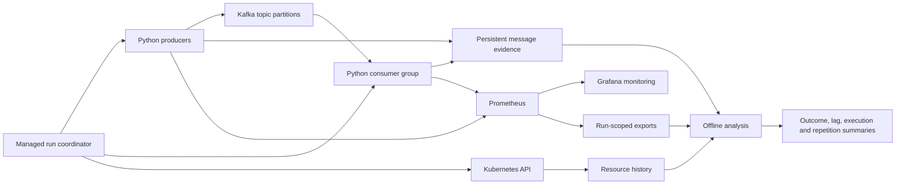

# Pipeline architecture

The platform separates application processing, experiment coordination and evidence analysis. This separation lets a run retain its configuration and observations even when the consumer count changes.

## Application data path

Producers generate the configured workload and record logical message identities, production timestamps and delivery acknowledgements. The consumer application reads records from its assigned Kafka partitions, performs the configured synthetic processing work and records completion evidence. Shared runtime code provides the managed-run identity, configuration and schedule.

The core ownership unit is a whole Kafka partition. A consumer can own several partitions, while different consumers can process different partitions in parallel. The current application does not turn a single partition into several independently executing workers. The distinction matters when a hotspot persists after consumer scaling.

Completion currently means the end of the configured application work, before commit acknowledgement. There is no durable external business-effect sink. A successful producer acknowledgement, a consumer completion and a committed offset are distinct events.

## Experiment control path

`my-shell/run_experiment.py`, exposed through `save-run.sh` and `run_pipeline.sh`, coordinates readiness, frozen configuration, production, evaluation, bounded drain and evidence collection. A run identifier separates measurements from earlier runs. Repetition analysis uses the exact run paths created by a batch.

The coordinator supports scheduled no-action and scale-up pilots. For scale-up, it changes the consumer replica count through Kubernetes; the consumer group then changes ownership through its configured assignment mechanism. The consumer supervisor allows newly created replicas to enter the managed workflow. The plan and observed events are recorded separately.

A scheduled intervention is an experimental treatment. It is not the planned adaptive controller: the runner does not diagnose skew and autonomously choose between waiting, targeted reassignment and scaling. Targeted consumer ownership transfer has experimental code paths and remains a separate live-validation and performance-evaluation task. Moving broker replicas or changing pod placement is not a substitute for it.

## Evidence and monitoring

Prometheus and Grafana provide time-series monitoring. Persistent message evidence supports offline questions that a dashboard alone cannot answer, including which acknowledged records remain unfinished and whether completion attempts repeat. Resource history retains observations about consumer pods, including removed or restarted instances.

The main offline tools have complementary responsibilities:

| Tool | Responsibility |
|---|---|
| `evaluate_run.py` | Identity checks, acknowledged cohorts, completion outcomes and partition results |
| `analyze_lag.py` | Valid partition snapshots, backlog/lag trends, imbalance and coverage |
| `analyze_execution.py` | Process lifetimes, resource-request integration and intervention/recovery observations |
| `summarize_runs.py` | Compatible-run grouping and separate run-level and pooled summaries |

Missing observations remain unavailable. They are not converted to zero backlog, zero cost or successful recovery. The [metric reference](metric-definitions.md) defines the exact endpoints and denominators.

## Deployment boundary

The supplied environment uses Kubernetes and Nautilus-specific operational resources. Client and broker versions, resource declarations, actual assignments and workload settings must be recorded for each comparison. Source synchronization and configuration application are separate operations. Consult the [deployment guide](nautilus-measurement-update.md) before changing a running environment.

The experimental architecture is designed to support the thesis questions. Claims about production readiness, arbitrary stateful applications, exactly-once external effects or a completed adaptive policy require additional implementation and evidence.
