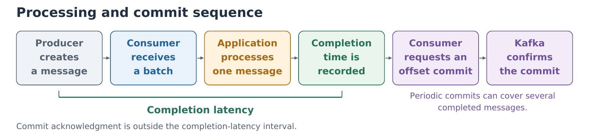

# Processing completion and offset commits

The consumer processes messages one at a time and records when each finishes. It periodically asks Kafka to save its completed progress. Receiving a message alone does not mark it as completed. Automatic commits and automatic offset storage are disabled, so the application controls which completed offsets are submitted. Commits are also attempted during normal partition handover and orderly shutdown. Completion latency ends when processing finishes, before Kafka confirms the commit.



The [vector figure](figures/consumer-commit-sequence.pdf) can be rebuilt with ReportLab:

```bash
python3 docs/figures/build_consumer_commit_sequence.py docs/figures/consumer-commit-sequence.pdf
```

## Example: received, completed and committed

Consider one partition processed sequentially. The application has received records 100–104. Records 100 and 101 have finished, record 102 is being processed, and 103 and 104 are waiting. Kafka last acknowledged a committed offset of 100, so progress through record 99 was saved.

| Progress measure | Value | Meaning |
| --- | ---: | --- |
| Consumer position | 105 | Records through 104 were received by the application; 105 is next to be received. |
| Completion frontier | 102 | Records through 101 finished; 102 is the next unfinished record. |
| Committed offset | 100 | Kafka's saved restart point is 100. |

The application received five records but finished only two. If it crashes before a newer commit succeeds, normal consumption resumes from offset 100. Records 100 and 101 may therefore be processed again. Later commits advance the restart point only through successfully completed work. Reading and committing do not delete records from Kafka; retention settings govern their removal.

Kafka client documentation uses **returned** to mean that a receive call hands fetched records to the application. It does not mean sending them back to Kafka, and it does not establish processing completion.

## Offset commits during group changes

Completion is recorded after the configured work and before offset-commit acknowledgment. The completion frontier used for lag starts at the assigned offset; only offsets advanced by successfully processed messages are submitted for commit. Fresh assignments therefore do not send empty startup-progress commits.

Both global and per-partition commit errors are checked. ILLEGAL_GENERATION, UNKNOWN_MEMBER_ID and REBALANCE_IN_PROGRESS are recorded as group-transition commit failures. They do not by themselves stop processing. The next periodic request uses the latest completed offsets for partitions still owned by this consumer. Revoke/lost callbacks discard that ownership; the old owner does not retry those partitions. Other errors stop the process and invalidate its final evidence. A queued asynchronous request is never described as an acknowledgment.

Every commit result is retained in the event log. `consumer_commit_failures_total` includes unsuccessful requests; `consumer_commit_rebalance_errors_total` identifies the group-transition subset. These counts are separate from processing failures and deadline misses. A failed transition commit can cause replay from Kafka's last successful commit. Replayed completion attempts remain in the evidence and are deduplicated by message identity for cohort outcomes. This prototype does not claim exactly-once business effects or that every processing completion has been durably committed.

Startup attempt `run-20260912-052133` exposed the previous behavior: two consumers stopped after ILLEGAL_GENERATION errors while forming the group. No common production start was released. Its evidence is retained as a failed startup and excluded from performance comparisons. The revised coordinator reports failed readiness immediately. Shutdown checks also ignore exited zombie children instead of falsely reporting forced termination.

The commit/ownership regression checks use the real Python error and TopicPartition types with a mocked broker boundary. All 78 local tests passed. Live startup and scale-out validation must be recorded separately from these local tests.

API contracts: [Confluent Python commit and callbacks](https://docs.confluent.io/platform/current/clients/confluent-kafka-python/html/index.html#confluent_kafka.Consumer.commit), [librdkafka group-transition fix history](https://github.com/confluentinc/librdkafka/blob/master/CHANGELOG.md).
