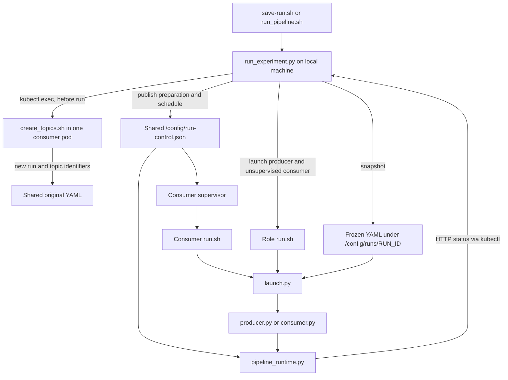
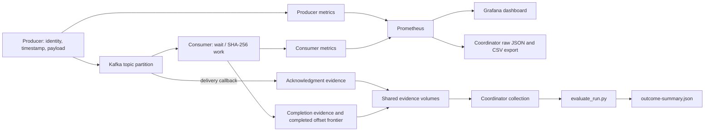

# Runtime commands, file relationships and data flow

This guide documents the runtime entry points and output formats for a configured Kubernetes deployment. The coordinator runs on a machine with the required Kubernetes context; producers and consumers run inside cluster pods. The [deployment guide](nautilus-measurement-update.md) describes dependencies, shared volumes, and monitoring setup.

## 1. Experiment execution

For routine work after the one-time setup, choose one of these commands:

```bash
# Run from the root of the repository checkout.
bash my-shell/save-run.sh
```

Or repeat the shared configuration five times:

```bash
bash my-shell/run_pipeline.sh --repetitions 5
```

Both wait through production, drain and final process snapshots, collect and export, then run outcome, lag and execution analysis. The repeated command also summarizes exactly its own completed runs. No separate stop/export/evaluation commands are needed on the successful path. The detailed actions below are for setup or troubleshooting.


Open a terminal in the code folder:

```bash
# Run from the root of the repository checkout.
bash my-shell/save-run.sh --help
kubectl config current-context
```

The default namespace is `kafkastreamingdata`. Set `NAMESPACE` in the terminal running the coordinator if yours differs. The supplied Kubernetes manifests contain their own namespace settings and must match your deployment.

### Before changing source or configuration

```bash
bash my-shell/save-run.sh stop
```

If the previous run matters, collect/export it before starting another one: collection commands address the current shared run control, not an arbitrary older RUN_ID.

```bash
bash my-shell/save-run.sh export
```

Export needs the Prometheus connection described below. If Prometheus is unavailable, save the persistent evidence separately:

```bash
bash my-shell/save-run.sh collect
```

Edit `/config/pipeline-configmap.yaml` once on the shared volume while applications are stopped. All replicas share this original file. The local `src/pipeline-configmap.yaml` is the template, not an automatic live update. `sync-code.sh` deliberately copies code only.

After local source changes:

```bash
bash my-shell/sync-code.sh
```

This verifies that applications are stopped, copies files once to each role's shared volume, then verifies hashes through every current replica. It does not remove older files already present on Nautilus. Those older files are not launched by the managed entry points. Do not erase the shared volume or `.code_initialized` marker to clean them up.

### Start and inspect a run

```bash
bash my-shell/save-run.sh start
bash my-shell/save-run.sh status
```

`start` returns after readiness and scheduling; it does not wait for the whole experiment or automatically export. Applications obey the published schedule even after this command returns. Read the printed RUN_ID. `status` prints each pod's run ID, incarnation, configuration hash, phase and failure/evidence information; consumers also report assignments.

With no action, `bash my-shell/save-run.sh` completes and analyzes one run automatically. For the older interactive prompts, use `bash my-shell/save-run.sh interactive`; that troubleshooting mode retains its separate evaluation step.

### Connect Prometheus and Grafana

Complete-run commands automatically connect to the existing Prometheus service for export. A second terminal is optional for viewing Grafana or for manual export. For that case, keep this running:

```bash
# Run from the root of the repository checkout.
bash my-shell/port-forward-prometheus-grafana.sh
```

The helper uses the supplied `prometheus-svc` and `grafana-svc` services in `kafkastreamingdata`. For another namespace, use explicit forwards in separate terminals:

```bash
kubectl -n YOUR_NAMESPACE port-forward svc/prometheus-svc 9090:9090
kubectl -n YOUR_NAMESPACE port-forward svc/grafana-svc 3000:3000
```

Open Prometheus at http://localhost:9090 and Grafana at http://localhost:3000. Import `grafana/KafkaDashboardPerConsumerMetrics.json`, choose the data source and select your run. The export command defaults to `PROM_URL=http://localhost:9090`; override it if your Prometheus URL differs.

### Finish, export and evaluate

Wait for the configured production interval, drain and final scrape hold. To end production early while still allowing the drain:

```bash
bash my-shell/save-run.sh stop
bash my-shell/save-run.sh export
```

Replace RUN_ID below with the value printed by `start`:

```bash
python3 python-scripts/evaluate_run.py results/RUN_ID
```

`export` copies evidence and then queries Prometheus. It does not run the evaluator. Check both `export-status.json` and `outcome-summary.json`. An exporter failure can leave useful partial files; their presence does not mean export succeeded. The evaluator returns exit code 2 when it detects validity failures.

### Rate sweeps

```bash
bash my-shell/run_pipeline.sh --rates 1000 2000 3000 --repetitions 5
```

This creates 15 sequential runs, updating TARGET_RATE in the shared YAML before each run. Each rate is per producer. Without --rates, run_pipeline.sh repeats the current shared target rate. Before each run, the coordinator restores the initial consumer count from `--initial-consumers` when supplied, otherwise from the shared `CONSUMER_POD_COUNT`. Producer replicas must already match `PRODUCER_POD_COUNT`; the runner validates that count instead of resizing producers. Each run waits, collects, exports and writes outcome-summary.json, lag-summary.json and runner-status.json before the next starts. A failure stops the sequence. Completed batches write repetition-summary.json and the exact run paths in batch-status.json under results/batches/BATCH_ID. The final explicit rate remains in the shared YAML.

### One producer and one consumer

Between experiments, set the producer StatefulSet to one replica and set both `PRODUCER_POD_COUNT` and `CONSUMER_POD_COUNT` to `1` in the shared configuration. The complete managed command restores one initial consumer and validates the producer count. Use HPA bounds that permit the declared counts; the complete command temporarily pauses conflicting scaling decisions and restores the settings it saved afterward. A standalone pod process test is also possible after stopping the managed run and creating appropriate topics:

```bash
# In the consumer pod:
PIPELINE_STANDALONE=true bash /app/consumer-merge-data/run.sh
# In a separate terminal inside the producer pod:
PIPELINE_STANDALONE=true bash /app/producer-data/run.sh
```

Standalone timing is local to each process. Use managed runs for comparisons. Set replica counts back to the desired baseline before a larger experiment.

## 2. Where each file runs

| File or group | Runs where | Responsibility and connection |
|---|---|---|
| `my-shell/save-run.sh` | Local terminal | Runs one complete experiment by default; explicit actions remain for troubleshooting. |
| `my-shell/run_pipeline.sh` | Local terminal | Repeats the shared configuration or explicit rates through the same coordinator, then summarizes the batch. |
| `my-shell/run_experiment.py` | Local terminal | Coordinates preparation, full-run waiting, collection, temporary Prometheus forwarding, export and automatic analysis; retains individual troubleshooting actions. |
| `my-shell/managed_hpa.py` | Local terminal through the complete-run coordinator | Saves, temporarily pauses and conditionally restores the HPA settings owned by this invocation. |
| `my-shell/sync-code.sh` → `sync_code.py` | Local terminal | Imports coordinator connection helpers; copies and verifies the role and common code on shared volumes. |
| `src/pipeline-configmap.yaml` | Local template/image defaults | Seed configuration for new storage; the existing shared file is edited separately. |
| `src/consumer/create_topics.sh` | One consumer pod | Reads the shared original, creates topics and writes new RUN_ID/TOPIC_TITLE before the coordinator freezes it. |
| `src/producer/run.sh`, `src/consumer/run.sh` | Their pods | Set the application directory and execute the shared launcher for their role. |
| `src/common/launch.py` | Each application start | Reads the frozen YAML for a managed run, exports settings and executes the role's Python program. |
| `src/common/pipeline_runtime.py` | Imported in both roles | Common timing, per-pod lock, HTTP status/metrics, signal handling, asynchronous evidence and final snapshots. |
| `src/consumer/supervise.py` | Consumer container's main process | Watches run control and launches one consumer for each new active RUN_ID; forwards termination to it. |
| `src/producer/producer.py` | Each producer pod | Generates/routes workload, attaches identities/timestamps, records broker acknowledgments and exposes producer metrics. |
| `src/consumer/consumer.py` | Each consumer pod | Handles partition ownership, performs synthetic work, records completion, commits completed progress and measures lag. |
| `k8s/statefullsets/{producer,consumer}-sts.yaml` | Kubernetes deployment definitions | Mount configuration/application volumes, bootstrap code if absent and define container startup/ports/grace periods. |
| `dockerfiles_confluent/{producer,consumer}.Dockerfile` | Image build | Copy the role code and common modules into `/code`, and the YAML into `/defaults`. |
| `dockerfiles_confluent/runtime-requirements.txt` | Image build/test environment | Pins application dependencies used for local verification. |
| `k8s/serviceaccount/prometheus-discovery.yaml` | Kubernetes permissions | Allows the supplied Prometheus instance to discover pods. |
| `k8s/grafana-prometheus/prometheus-{configmap,deployment}.yaml` | Prometheus deployment | Configure dynamic scraping of metrics ports, including new replicas. |
| `grafana/KafkaDashboardPerConsumerMetrics.json` | Grafana | Displays Prometheus measurements for a selected run. |
| `python-scripts/evaluate_run.py` | Local machine after collection | Joins acknowledgment and completion evidence using a temporary SQLite database; writes the outcome summary. |
| `tests/test_measurements.py`, `tests/test_lifecycle.py` | Local tests | Check measurement semantics, active export behavior and application lifecycle boundaries without a real cluster. |

The common modules are kept once in the source tree. Image building and synchronization copy them alongside each role's Python file on its own volume. That deployed duplication is necessary because the two roles have separate application mounts.

Consumer supervision and the local coordinator have different jobs: the coordinator defines the experiment; the supervisor lets a newly scaled consumer join it. The supervisor makes one launch attempt per RUN_ID in its own lifetime. An application failure is visible; it is not an automatic same-run retry loop. The current producer deployment does not have a matching supervisor, so adding a producer during a run is not supported by this automatic-start mechanism.

## 3. Control flow



The source YAML stays shared and writable. Each managed experiment uses a frozen copy so a later accidental edit cannot change only part of an experiment. Timing and early-stop updates travel through run-control.json, which runtime checks at roughly 0.2-second intervals. Changes are observed across replicas, not instantaneously at exactly the same CPU instruction.

Startup order:

1. Stop the previous producer applications and allow consumer drain/cleanup.
2. Discover initial pods, create new topics, read and validate configuration.
3. Save the frozen YAML and publish `preparing` control.
4. Start consumers and producers. Production waits for release.
5. Check ready status, matching configuration hashes, and exactly one consumer owner for every expected partition. Require three stable assignment observations.
6. Record coarse clock probes, then publish a start time five seconds in the future and the production/drain deadlines. Save the initial manifest.

The shared initial manifest records startup. Collection writes the current control to the local `manifest.json`, including an early-stop schedule change when present. Do not manually modify run-control.json during a run.

## 4. Workload and measurement data flow



Each message carries a RUN_ID, unique message ID and producer timestamp. The producer chooses a partition according to the configured balanced/skew workload. A delivery callback records acknowledgment, including the actual broker partition/offset. Enqueue/delivery failures are recorded separately; unresolved sends are reported after the bounded producer flush.

The consumer reads the headers, records processing-start latency, performs the configured work, then records completion latency and an output SHA-256. Completion latency is the completion timestamp minus the producer timestamp; it includes the waiting/CPU work. Completed progress advances only after processing succeeds. Commits use the completed offset frontier. Rebalances record assign/revoke/lost events; lost ownership does not commit.

Prometheus holds aggregate counters, histograms, resource metrics and partition observations. Grafana visualizes those series; it does not collect or own them. The exporter queries Prometheus directly with the exact run ID and preserves all labels and NaN values in JSON and CSV.

Outcome evidence contains information aggregates cannot reconstruct: message identity, acknowledgment/completion pairing, replays, unfinished cohort members, ownership changes and final process state. It is queued and written by a separate thread instead of synchronously writing a CSV on every message. Buffer drops or write errors make the evidence incomplete and invalidate the run. This still has overhead that must be measured on Nautilus.

The evaluator admits acknowledged messages whose producer timestamps fall in the evaluation interval, then joins them to the earliest recorded completion by the drain bound. It reports incomplete messages, deadline misses, duplicate attempts and conditional empirical p99. Useful throughput counts unique completions in the evaluation time window; it is a different population from the admitted cohort followed through drain. A rolling Grafana histogram p99 is also a different statistic. Do not average rolling or per-consumer p99 values to obtain a combined run p99.

## 5. Timing and expected elapsed time

Let S be the common start, D=EXP_DURATION_SEC, W=WARMUP_SECONDS and R=DRAIN_SECONDS:

| Interval | Behavior |
|---|---|
| Preparation before S | Topic creation, readiness and clock probes; no production released. |
| S to S+W | Warm-up production and consumption; excluded from the admitted evaluation cohort. |
| S+W to S+D | Evaluation admission window; production continues. |
| S+D to S+D+R | Producers stop enqueuing and flush outstanding deliveries; consumers continue processing. |
| Cleanup and final hold | Consumers commit/close; both roles close evidence and retain final metrics for FINAL_SCRAPE_SECONDS. |

With D=300, W=0, R=60 and final hold=15, the scheduled production, drain and hold total about 375 seconds. Preparation, cleanup, transfers and Prometheus queries add time. Waiting commands add a 10-second margin and may wait longer for final snapshots. This is not a guaranteed wall-clock runtime.

Drain expiry is a bound, not a guarantee that every message completed. Inspect `incomplete_by_drain`. The coordinator requires drain to cover both the configured deadline and producer flush timeout. Cross-node timestamps also require measured clock synchronization; kubectl clock probes alone cannot establish millisecond accuracy.

## 6. Output locations

### Persistent files on Nautilus

```text
/config/pipeline-configmap.yaml                  editable original
/config/run-control.json                        current run control
/config/runs/RUN_ID/pipeline-configmap.yaml      frozen configuration
/config/runs/RUN_ID/manifest.json                initial run manifest
/app/producer-data/evidence/RUN_ID/POD/INCARNATION/
/app/consumer-merge-data/evidence/RUN_ID/POD/INCARNATION/
    events.jsonl
    final.json
    final.prom
```

The evidence roots can be overridden in YAML. INCARNATION distinguishes separate processes even when they use the same pod name. Shared storage allows evidence from a removed replica to remain collectible through another replica of that role. Collection requires at least one accessible pod for each role. Collection uses up to three retries and a 900-second overall timeout per role; the large copy stream has no shorter API deadline. Normal Kubernetes API requests still use a 30-second deadline. Each role is copied to staging and replaces the collected role only after a successful transfer, so an interrupted copy preserves the previous local evidence. The source evidence on Nautilus is retained. Exact analysis of millions of messages can take longer than production and needs temporary local disk space.

### Local files after collection/export

```text
results/RUN_ID/
    manifest.json
    pipeline-configmap.yaml
    producer/POD/INCARNATION/{events.jsonl,final.json,final.prom}
    consumer/POD/INCARNATION/{events.jsonl,final.json,final.prom}
    prometheus-query.json
    prometheus.json
    prometheus.csv
    export-status.json
    outcome-summary.json                       after evaluation
```

`export-status.json` checks that Prometheus observed the collected process incarnations. A complete status does not prove every scrape was present or the experiment was scientifically valid. Inspect evidence validity, clock measurements and scrape coverage too. `final.prom` is durable text; the current workflow does not backfill it into Prometheus.

## 7. Troubleshooting

| Symptom | Check/action |
|---|---|
| Readiness timeout | Run status, compare RUN_ID/config hashes, inspect assignments, broker connection and group settings; production was not released. |
| Empty pod lists or kubectl error | Check context, namespace and `app=producer-sts` / `app=consumer-sts` labels. |
| Old source still running | Stop, synchronize, check sync hash verification. Merely editing local code does not update a PVC. |
| New consumer does not start | Confirm its StatefulSet uses supervise.py and shared control/code mounts; inspect pod logs and control expiry. |
| Export says wait for drain | Wait through cleanup and final hold, or use stop to shorten production gracefully. |
| Prometheus connection refused | Start/repair the port-forward and check PROM_URL. |
| Missing incarnations in export | Check Prometheus targets/discovery, scrape interval and retained run time range. Preserve evidence and the incomplete status. |
| Lag is NaN | Check validity/freshness and query errors; NaN is unknown lag, not zero backlog. |
| Evaluator validity failures | Inspect named final records, evidence errors/drops, unresolved sends and clock observations. Keep the failed run for diagnosis. |

For supervised consumers, use container logs:

```bash
kubectl -n kafkastreamingdata logs consumer-sts-0 -c consumer-container --tail=100
```

For manually launched producers, the coordinator redirects stdout/stderr to a shared log:

```bash
kubectl -n kafkastreamingdata exec producer-sts-0 -c producer-container -- \
  tail -n 100 /app/producer-data/logs/run_producer-sts-0.log
```

An unsupervised consumer launched by the coordinator similarly logs under `/app/consumer-merge-data/logs/run_consumer-sts-0.log`. Change pod names as needed.

## 8. What remains outside the active runtime

See [the archive inventory](../archive/legacy-before-managed-runs/README.md) for all moved files and replacements. The active runtime needs no archived imports or exporters. Existing historical measurements and backups are retained. Kubernetes/Helm broker setup, storage, monitoring infrastructure and node clock checks remain separate operational tools; they are not automatically invoked for each experiment.

The adaptive controller, targeted reassignment and older statistical analyses are archived research prototypes. Current sweeps compare configured workloads; they do not implement the proposal's adaptive-policy comparisons. Cluster testing is still required before relying on the measurements.

## 9. Analyze collected experiments

Run these from the code directory after collection and Prometheus export. Replace RUN_ID and run names with actual collected directories.

```bash
python3 python-scripts/evaluate_run.py results/RUN_ID
python3 python-scripts/analyze_lag.py results/RUN_ID --window-samples 15 --hot-k 1 --minimum-lag 10 --persistence 0.8 --max-gap 3
python3 python-scripts/summarize_runs.py results/RUN_A results/RUN_B results/RUN_C --output results/repetition-summary.json
```

The evaluator writes outcome-summary.json. The lag analyzer writes lag-summary.json, including invalid samples and coverage. The repetition command recomputes outcomes from source evidence and writes the requested summary outside input run directories. It separates incompatible configurations and reports excluded invalid runs. Exit code 2 from evaluation/repetition analysis indicates invalid evidence, not necessarily a command failure. Inspect the reported reasons.

Data flows from frozen run configuration to producers/consumers, then to two complementary outputs: identity events and final snapshots on shared storage, and aggregate metrics scraped by Prometheus. Collection preserves both. evaluate_run.py joins identities; analyze_lag.py reconstructs valid lag snapshots; summarize_runs.py combines matching runs. Grafana reads rolling metrics independently. No analysis script sends controller actions.

See [metric-definitions.md](metric-definitions.md) for exact populations, units, formulas, missing-data rules and the distinction between implemented measurements and the implemented resource/recovery diagnostics and their limits. Synchronize changed source with the existing sync workflow before the next managed Nautilus run; a local edit does not change running pods. Keep APP_DELAY_MS=0 for the baseline and use the printed capacity estimate only as a pilot guide.


## 10. Scheduled pilots and new results

First synchronize the changed consumer source **between experiments**. These are setup commands, not the commands to repeat for every run:

```bash
# Run from the root of the repository checkout.
bash my-shell/save-run.sh stop
bash my-shell/sync-code.sh
```

The ordinary one-run and multiple-run commands at the top of this guide now produce the expanded metrics automatically. They do not request an intervention. Retention is checked for each independent run: production + drain + readiness + 120 seconds, not the sum of all repetitions. The default timing requires 660000 ms; 86400000 ms is the template value. Retention is a data lifetime, so setting 24 hours does not make the runner wait 24 hours.

For an optional no-action pilot with a common comparison anchor:

```bash
bash my-shell/save-run.sh --intervention none \
  --intervention-after 60 --initial-consumers 6 \
  --recovery-threshold 10 --recovery-hold 30
```

For one scheduled scale-up pilot from six to seven consumers:

```bash
bash my-shell/save-run.sh --intervention scale \
  --intervention-after 60 --initial-consumers 6 --target-consumers 7 \
  --recovery-threshold 10 --recovery-hold 30
```

For five repetitions of that scale-up pilot:

```bash
bash my-shell/run_pipeline.sh --repetitions 5 --intervention scale \
  --intervention-after 60 --initial-consumers 6 --target-consumers 7 \
  --recovery-threshold 10 --recovery-hold 30
```

These are command examples, not calibrated thesis settings. The shared evaluation interval must exceed 60 seconds. Select replica counts appropriate for the experiment. `--initial-consumers` explicitly authorizes restoring that count before each run, after stopping the preceding applications; the last scale-up leaves the target replica count in place. It does not reset itself after the final run. `--intervention-after` is seconds after evaluation start. Recovery options are optional but must be supplied together. The scaling path requires the documented consumer supervisor setup. The application and Kafka client remain sequential and broker-coordinated.

For an action comparison, keep workload seed/settings, resources, initial counts and timing equivalent. Inspect the recorded initial assignment; cooperative-sticky does not guarantee the same map after every new group starts. The summary separates different maps and action plans. Targeted partition movement is not implemented, so these scripts cannot yet execute the full three-action comparison. No-action and scale-up are pilots for measurement validation and capacity/disruption calibration.

The runner records the actual decision time and request completion. A late decision is visible as scheduling delay. An action whose time was missed beyond evaluation is rejected. Ctrl+C/stop cancels any pending intervention before draining; cleanup never triggers the scheduled scale-up. Repeated runs stop at the first failure and retain existing evidence. Do not run competing controllers or coordinators during a controlled pilot.

New files in each `results/RUN_ID/`:

| File | Contents |
|---|---|
| `outcome-summary.json` | Pipeline and per-partition p50/p95/p99, rates, unfinished/deadline results and identity/within-epoch ordering checks. |
| `resource-history.jsonl` | Coordinator-side consumer pod UID/readiness/resource-request snapshots, including errors and pods later removed. |
| `intervention-events.jsonl` | Optional scheduled decision, scale API completion and observed pod readiness. Absent for an ordinary run. |
| `execution-summary.json` | Consumer process lifetimes, sampled request-time/coverage, ownership callbacks and optional censored backlog recovery. |
| `manifest.json` | Frozen timing/configuration, recorded initial assignment and optional intervention plan. |

The batch's `repetition-summary.json` adds partition groups, pooled p50/p95/p99, run-level execution/resource metrics and recovery censoring. Historical folders missing the new evidence have unavailable metrics; reanalysis cannot invent resource history or ordering epochs.

The two shell entry points call `run_experiment.py`. That coordinator publishes the frozen manifest and handles optional replica changes, resource snapshots and collection. `consumer.py` emits completion/ownership evidence alongside Prometheus metrics. `evaluate_run.py` uses `partition_outcomes.py` for partition rates and evidence checks. `analyze_lag.py` supplies coverage-checked backlog samples. `analyze_execution.py` combines lifetimes, resource snapshots, callback events and optional recovery settings. `summarize_runs.py` recomputes these results for exactly the completed runs in the batch. All analyzers run locally after collection; none sends a scaling action.

Full definitions, examples and exclusions are in [metric-definitions.md](metric-definitions.md).

## Fixed replicas with an existing HPA

The complete one-run and repeated-run commands now save the original HPA settings,
stop the preceding applications, and temporarily disable competing scale-up and
scale-down decisions. They may lower the saved minimum to the declared baseline;
they never increase the HPA maximum. Each run restores the configured initial
consumer count before readiness. The common HPA pause lasts across a whole batch,
then its original settings are restored after collection, including on a handled
failure or Ctrl+C. A controller already paused before the command is left under
its existing owner's control.

The backup and restoration status are saved under
`results/controller-settings/hpa-TIMESTAMP-ID.json`. Restoration checks both the
controller UID and its exact paused specification. If someone changed or replaced
it, those changes are preserved and the command reports a pending restoration.
After a hard process termination or machine loss, inspect that saved file. To
retry restoration of unchanged settings, run:

```bash
python3 my-shell/managed_hpa.py results/controller-settings/hpa-TIMESTAMP-ID.json
```

Replace the filename with the actual saved record. A hard termination cannot run
Python cleanup; the file is a recovery record, not an automatic cluster-side timer.
Manual `start` and standalone preflight still require intentionally paused,
compatible controller settings. These changes control experiment isolation; they
do not implement an HPA baseline or the proposed adaptive mitigation selector.

## Matched starting conditions for controlled comparisons

The coordinator can check a frozen complete partition ownership and pod-placement reference with `--placement-reference`. It rejects a mismatch before publishing the running state and checks again before a scheduled action. `--prepare-only` saves a preparation without releasing production; `--preparation-budget` bounds time to the production gate. The reference and observations are retained with run evidence. For the bounded concentrated-input scale/no-action comparison and its restoration rules, see [controlled execution](../experiments/controlled-followup-20260912/EXECUTION.md).

## Optional controlled static startup

The revised preparation protocol derives a unique static Kafka member ID from each consumer pod, waits for previous group members to leave, and captures actual complete ownership before any production. Four empty preparations check capture, restart, six consumers and return to three. The complete original three-consumer reference remains fixed. Performance trials require an explicit option and all four checks to pass. See `experiments/controlled-followup-20260912/STATIC_STARTUP.md` and its reviewed JSON plan. This code is awaiting user confirmation and live validation; the six earlier failed preparations remain separate evidence.
