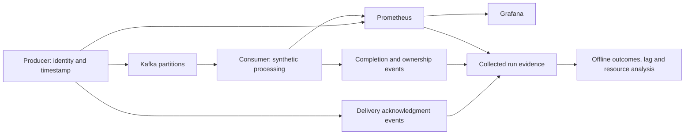

# Runtime and data flow

The coordinator runs on a machine with Kubernetes access. Producer and consumer applications run in cluster pods. Shared configuration defines the workload; persistent events and Prometheus exports provide the evidence used in offline analysis.

## Running an experiment

After [deployment setup](nautilus-measurement-update.md), one command runs preparation, warm-up, evaluation, drain, collection and analysis:

```bash
bash my-shell/save-run.sh
```

Two repetitions of the shared configuration:

```bash
bash my-shell/run_pipeline.sh --repetitions 2
```

The batch records exactly which run directories it created and stops on a failure. `--rates` sets **per-producer** target rates; the dedicated [calibration runner](../experiments/stability-fixed3-20260921/README.md) instead accepts aggregate rates. The intervention comparisons use their [protocol-specific runner](../experiments/four-condition-20260929/README.md).

The default namespace is `kafkastreamingdata`. The coordinator's `NAMESPACE` override and the namespace declared in deployment resources must agree. `--help` lists command options.

## Preparation and control

1. Stop preceding applications and retain their evidence.
2. Restore the declared initial consumer count, validate pods and create fresh run-specific topics.
3. Save the configuration under `/config/runs/RUN_ID/` and publish preparation state.
4. Start applications and verify readiness, configuration hashes and unique ownership of all partitions. Controlled comparisons additionally verify their saved starting reference.
5. Publish common warm-up, evaluation and drain boundaries. Producers wait for release.
6. Apply any declared scheduled action and record its actual timing and outcome.
7. Stop production at its boundary, allow drain, retain final snapshots, then collect and analyze.

Warm-up records are excluded from the evaluation cohort but remain real queued work. The schedule is shared through `run-control.json`; a later edit to the original YAML does not change a running experiment's saved configuration. Old topics are not automatically deleted.

The complete-run workflow temporarily pauses conflicting HPA decisions within the declared replica limits and restores the settings it saved. Restoration checks detect another operator's changes. A hard termination may prevent cleanup; the saved record under `results/controller-settings/` supports inspection and restoration:

```bash
python3 my-shell/managed_hpa.py results/controller-settings/hpa-TIMESTAMP-ID.json
```

The filename is a placeholder for the actual recovery record. This experiment isolation does not implement the proposed decision policy.

## File relationships

| File | Responsibility |
|---|---|
| `my-shell/save-run.sh`, `run_pipeline.sh` | Shell entry points for one run or a batch |
| `my-shell/run_experiment.py` | Readiness, timing, scheduled actions, collection and analysis |
| `my-shell/placement_control.py`, `static_startup.py` | Starting-condition checks |
| `my-shell/explicit_control.py`, `explicit_scale.py` | Coordinated whole-partition ownership transfer |
| `my-shell/sync_code.py` | Source copying and hash verification on shared volumes |
| `src/common/launch.py` | Load the saved configuration and launch a role |
| `src/common/pipeline_runtime.py` | Shared timing, process locks, status, metrics and event writing |
| `src/producer/producer.py` | Generate and route records; retain delivery acknowledgments |
| `src/consumer/consumer.py` | Process assigned records, retain completions, measure lag and commit completed progress |
| `src/consumer/supervise.py` | Launch a consumer for an active managed run |
| `python-scripts/evaluate_run.py` | Reconcile identities and compute cohort outcomes |
| `python-scripts/analyze_lag.py` | Valid lag/backlog snapshots, growth, skew and coverage |
| `python-scripts/analyze_execution.py` | Process lifetimes, requested resources and action observations |
| `python-scripts/summarize_runs.py` | Compatible-run and pooled summaries |
| `python-scripts/comparison_series.py`, `intervention_cost.py`, `validate_handoff.py` | Shared comparison analysis and handover checks |

## Data path


```mermaid
flowchart LR
    P[Producer: identity and timestamp] --> K[Kafka partitions]
    K --> C[Consumer: synthetic processing]
    P --> A[Delivery acknowledgment events]
    C --> E[Completion and ownership events]
    P --> M[Prometheus]
    C --> M
    M --> G[Grafana]
    A --> R[Collected run evidence]
    E --> R
    M --> R
    R --> O[Offline outcomes, lag and resource analysis]
```

A record includes a run ID, logical message ID and production timestamp. Delivery callbacks retain the actual topic, partition and offset. Consumers record processing start and application completion, then advance the completed offset frontier. Commit acknowledgment is a separate event. Targeted redistribution transfers whole partitions with verified offsets; it does not split their processing among consumers.

Prometheus supplies time-series measurements. Event logs supply message-level facts that histograms cannot recover: distinct completions, duplicate attempts and unfinished cohort members. Missing monitoring samples remain unavailable. Event buffer drops or write failures invalidate the corresponding evidence.

## Outputs and troubleshooting

Collected files and derived summaries are saved under `results/RUN_ID/`. Batch and campaign records identify their individual run directories. [Data availability](data-and-reproducibility.md) lists the files and backup requirements; [metric definitions](metric-definitions.md) gives the formulas.

The following are separate troubleshooting operations, not steps needed after a successful full run:

```bash
bash my-shell/save-run.sh status
bash my-shell/save-run.sh stop
bash my-shell/save-run.sh collect
bash my-shell/save-run.sh export
```

`collect` copies persistent evidence; `export` also queries Prometheus. Manual export does not run the evaluator. Collection addresses the current shared run control, so it must finish before another run replaces that control. Partial files do not by themselves establish a successful export. Evidence transfer checks are described in [evidence collection](evidence-collection.md).

The supervisor starts new consumer replicas automatically during a managed run. Adding producers during a run does not have the same automatic-start mechanism. Configuration, source synchronization and cluster deployment remain distinct operations.
