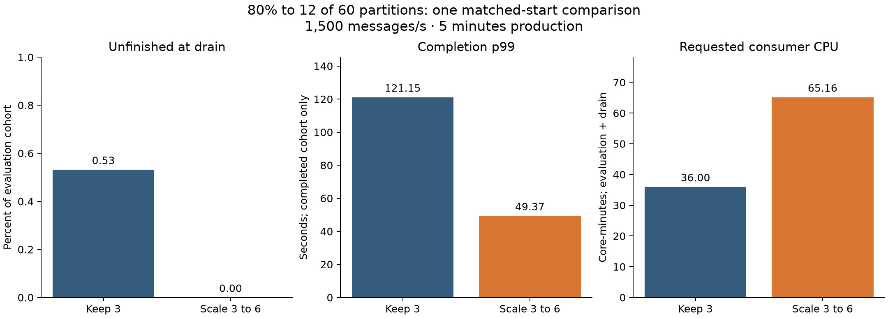
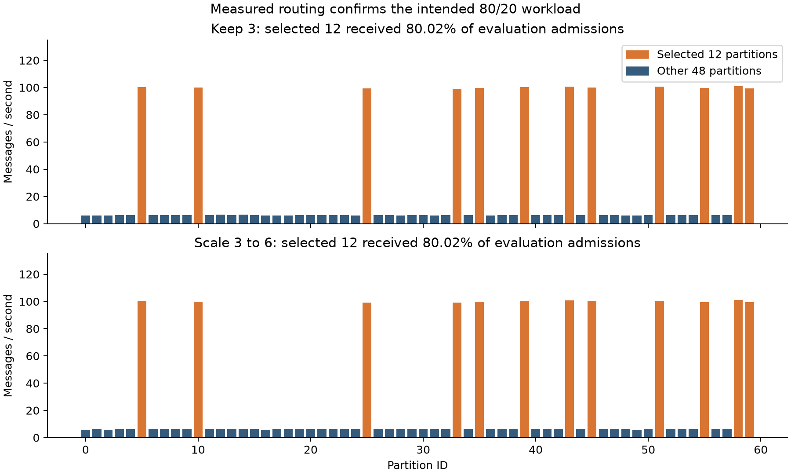

# 80/20 keep-three versus scale-to-six comparison — 13 September 2026

Four empty rehearsals and two performance trials completed. Both trials used the same frozen complete starting ownership and original pod identities/machines, verified before production and before the decision. No new node-placement rule was introduced. Original configuration, HPA settings and replica counts were restored and verified; a separate check found all experiment applications stopped.

This workload directs 80% of traffic to **12 of 60 partitions**, not to one partition. The selected IDs (common seed 71) are 5, 10, 25, 33, 35, 39, 43, 45, 51, 55, 58, 59. The remaining traffic goes only to the other 48 partitions. Selection is probabilistic per message; measured shares are reported below.

Three producers targeted 1,500 messages/s total, using a 100-byte payload setting, 2,000 SHA-256 iterations and no artificial sleep. Both trials used 300 seconds production including 60 seconds warm-up, followed by a 120-second drain. Scale ran first; keep-three followed. Scaling was scheduled at production +120 seconds. This first pair retained the preceding single-partition block's rate/work settings; it did not tune the rate after observing results or assume that 80/20 necessarily overloads the consumers.

| Treatment | Evaluation messages | Unfinished at drain | Completion p99 (s) | Requested CPU (core-min) | Lag coverage |
|---|---:|---:|---:|---:|---:|
| Keep 3 | 360,000 | 1,915 (0.53%) | 121.146 | 36.00 | 99.17% |
| Scale 3 to 6 | 360,000 | 0 (0.00%) | 49.370 | 65.16 | 87.50% |

P99 follows distinct acknowledged evaluation messages that completed by the fixed drain cutoff, after application processing and before commit acknowledgment. It is separate from rolling Grafana histogram estimates. Warm-up messages are excluded from this cohort. Requested CPU is integrated over the common 360-second evaluation-through-drain horizon; it is a declaration, not actual CPU consumption or money.

Keeping three consumers left 1,915 unfinished evaluation messages; scaling left 0. Recorded conditional p99 was 121.146 versus 49.370 seconds. This is one observed comparison, not a general guarantee or an independent replication series.

## Measurement limits

The scaling lag coverage is below the predeclared 90% screen, so this pair is **excluded from aggregate backlog reduction claims**. Per-run plots retain valid observations and gaps as diagnostics. Missing intervals are not zero and are not interpolated across ownership changes. Message outcomes remain evidence-valid.

- none: selected partitions received 80.019% of evaluation admissions; individual selected rates ranged 99.05–101.12/s, others 5.91–6.56/s. Selected/other unfinished counts: 1,399/516. Resource coverage: 100.00%. Decision delay after schedule: 7.63 s. Recovery record: not_observed_by_evaluation_end.
- scale: selected partitions received 80.019% of evaluation admissions; individual selected rates ranged 99.06–101.12/s, others 5.91–6.56/s. Selected/other unfinished counts: 0/0. Resource coverage: 100.00%. Decision delay after schedule: 7.24 s. Recovery record: not_observed_by_evaluation_end.

A recovery-threshold confirmation must not be described as recovery from overload if the run was already below threshold before the decision. The per-run recovery/status and time series are retained. The provisional 99 ms threshold is not used for an SLA success claim; cross-node clock uncertainty remains. New-consumer placement and changing shared-machine load remain uncontrolled. Reassignment and key splitting were not tested.

## Run records

- [run-20260913-002723](../run-20260913-002723/validation-report.md): capture_three, preparation_verified.
- [run-20260913-002938](../run-20260913-002938/validation-report.md): restart_three, preparation_verified.
- [run-20260913-003213](../run-20260913-003213/validation-report.md): prepare_six, preparation_verified.
- [run-20260913-003458](../run-20260913-003458/validation-report.md): return_to_three, preparation_verified.
- [run-20260913-003714](../run-20260913-003714/validation-report.md): scale_trial, complete.
- [run-20260913-004819](../run-20260913-004819/validation-report.md): keep_trial, complete.

Executed commit: `8ebf9f231f193eac9b061ffb81e08401aa257581`. All 126 collected evidence files match their PVC source hashes. Cumulative preparation: 823.99 seconds, within the 1,200-second bound; no retries.

[Exact summary](summary.json), [paired calculations](comparison/comparison-summary.json), [scaling plots](plots/scale/overview.png), [keep-three plots](plots/none/overview.png). Raw events and full exports remain in `results/RUN_ID/`, outside Git.

A verified lossless local archive contains all 182 result files (74,486,095 compressed bytes). The [backup manifest](evidence-backup-manifest.json) records its hashes and location. It is on this Mac, not an off-machine backup.
