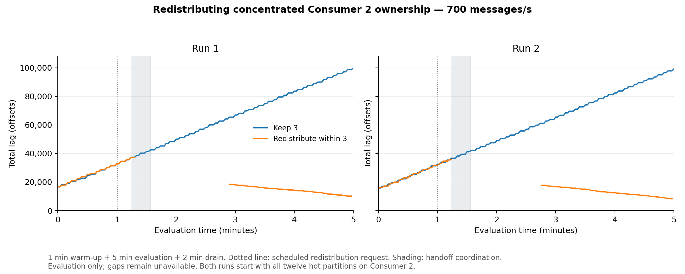
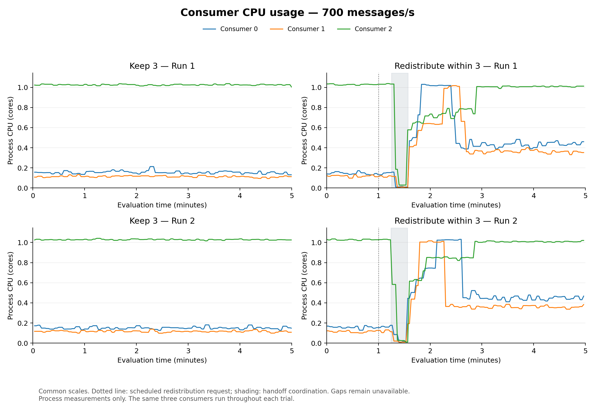
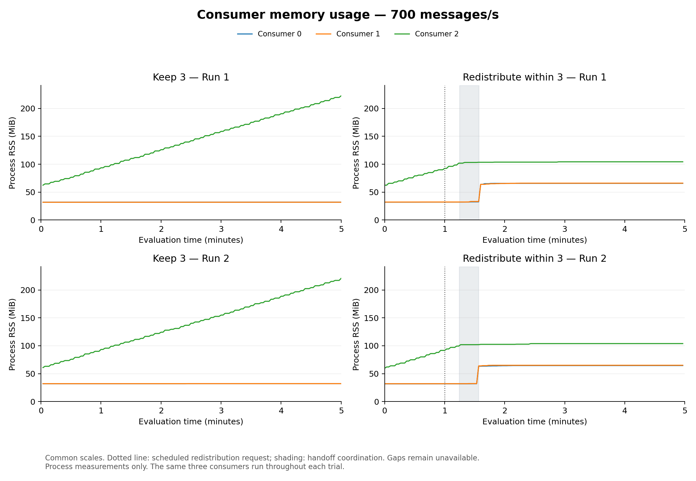
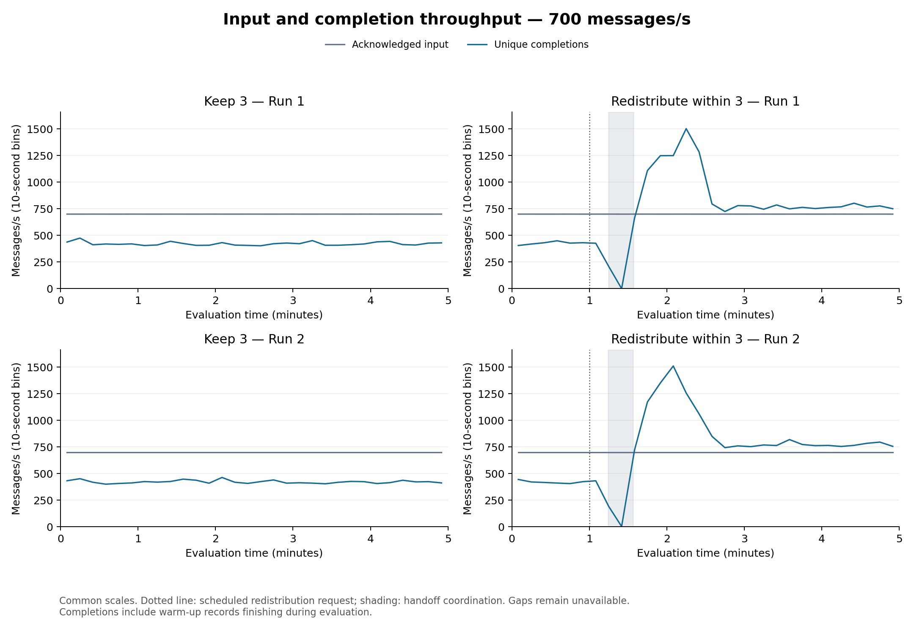
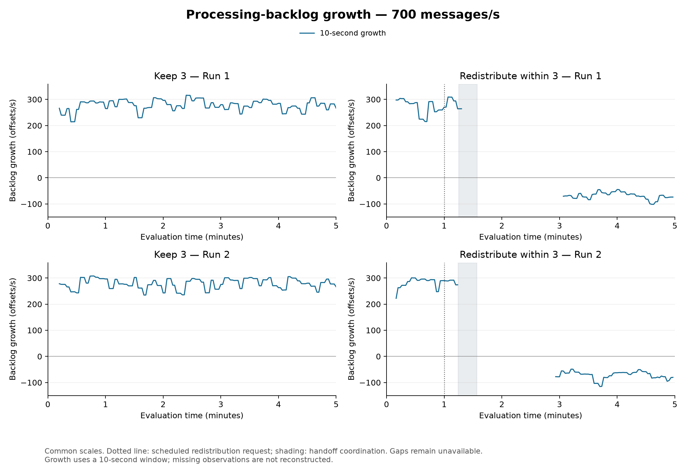
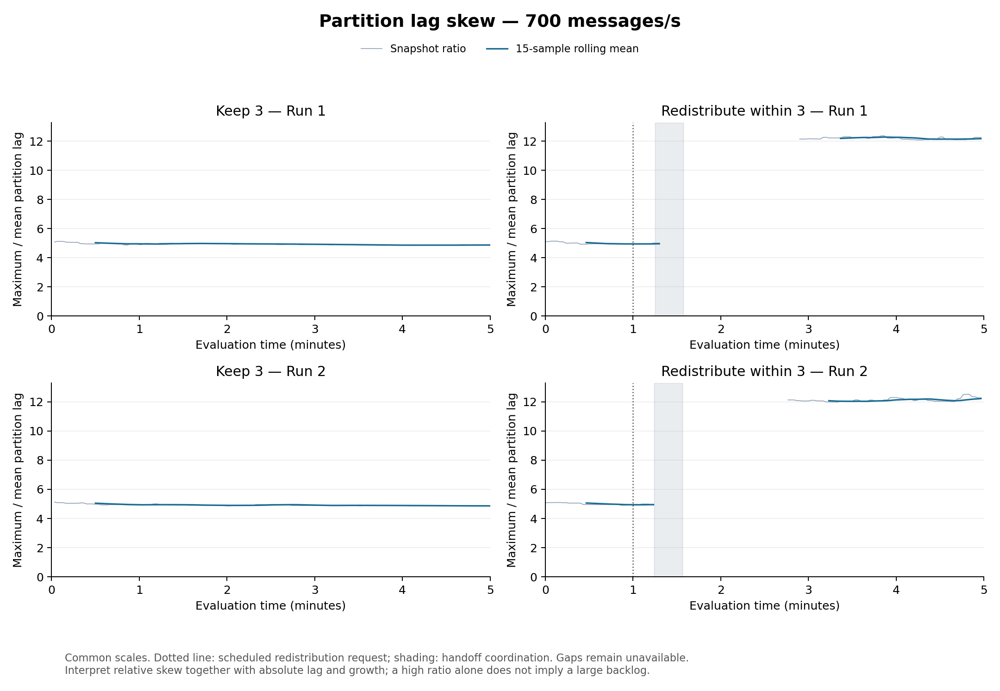

# Redistributing concentrated Consumer 2 ownership

Four performance trials used the same 700 msg/s aggregate 80/20 input and verified starting ownership. Each lasted eight minutes (one warm-up, five evaluation, two drain). Every run started with twelve hot partitions on Consumer 2. Redistribution was scheduled for evaluation +60 seconds, giving each of the same three consumers four hot and sixteen cold partitions. The short technical validation is separate from the performance count.

Growth plots now use a **10-second window**, recomputed from the saved observations for every trial in this comparison. This post-trial display update leaves the five-minute evaluation, numerical trial outcomes, skew mean and recovery criterion unchanged. Missing observations remain gaps; after a break, growth needs ten seconds of contiguous valid measurements.

| Run | Condition | Completion p99 (s) | Unfinished | Mean lag | Peak lag | Useful throughput (msg/s) |
|---|---|---:|---:|---:|---:|---:|
| 1 | Keep 3 | 226.340 | 30.182% | 58189.3 | 99,805 | 422.08 |
| 1 | Redistribute within 3 | 103.760 | 0.000% | 19243.1 | 37,159 | 725.25 |
| 2 | Keep 3 | 227.132 | 30.475% | 57329.3 | 99,153 | 421.76 |
| 2 | Redistribute within 3 | 91.376 | 0.000% | 17608.5 | 35,615 | 727.54 |

Both conditions admitted 210,000 evaluation messages per trial. The results below compare separate trials; each arrow runs from keep-three to redistribute-within-three.

- Run 1: completion p99 **226.34 → 103.76 s**; unfinished **30.18% → 0.00%**.
- Run 2: completion p99 **227.13 → 91.38 s**; unfinished **30.48% → 0.00%**.

| Run | Condition | Observed requested CPU (core-min) | Observed requested memory (GiB-min) | Resource coverage | Lag coverage |
|---|---|---:|---:|---:|---:|
| 1 | Keep 3 | 42.00 | 21.00 | 100.0% | 99.3% |
| 1 | Redistribute within 3 | 42.00 | 21.00 | 100.0% | 67.3% |
| 2 | Keep 3 | 42.00 | 21.00 | 100.0% | 99.3% |
| 2 | Redistribute within 3 | 42.00 | 21.00 | 100.0% | 68.7% |

Requested resources are integrated over observed intervals within five evaluation minutes plus two drain minutes. Partial coverage produces a partial integral, not the full cost. They describe reserved consumer resources, not measured consumption or whole-cluster cost. CPU and RSS plots show process measurements separately. Useful throughput counts distinct completions during evaluation, including warm-up messages completing then; it may therefore exceed the 700 msg/s input target while queued work is cleared.

The identity and offset checks passed for all four trials, with no duplicate completion identifiers, duplicate completed offsets or unmatched completion identities. Both intervention trials passed release, acquire and resume verification. This validates the recorded synthetic-workload handoffs; it does not establish exactly-once external application effects.

All producer and consumer pods, machines, resource settings and starting ownership matched the saved reference. No consumer replicas were added. This block tests moving hot partitions away from the initially overloaded owner while keeping the replica count fixed.

| Run | Condition | Observed process CPU (core-s) | Observed RSS integral (GiB-s) | Consumer CPU/RSS coverage range |
|---|---|---:|---:|---:|
| 1 | Keep 3 | 515.77 | 93.71 | 99.5–99.5% |
| 1 | Redistribute within 3 | 554.06 | 88.36 | 99.5–99.5% |
| 2 | Keep 3 | 516.49 | 93.07 | 99.5–99.5% |
| 2 | Redistribute within 3 | 553.41 | 87.44 | 99.5–99.5% |

Observed process integrals sum the three consumers over covered intervals in evaluation plus drain. CPU percent-seconds are divided by 100 to obtain core-seconds; byte-seconds are divided by 2^30 for GiB-seconds. The RSS integral measures memory footprint over time, not allocated memory or bytes processed. Missing intervals are omitted, not filled with zero; these sums are not complete costs when coverage is partial. Producer measurements remain available separately in comparison.json.

P99 is the nearest-rank percentile of completed evaluation messages through application completion, before commit acknowledgment. It is not an average of rolling p99 values. Mean lag is time-weighted over valid intervals. Missing observations and ownership transitions break plotted lines. Unfinished messages are counted at the fixed drain cutoff; warm-up messages remain queued but are excluded from that cohort.

The comparison tests a predefined assignment change with three consumers throughout. Original pods, resources and initial owners were checked against one fixed reference; machines were not pinned. Two runs per condition do not establish long-term stability or remove shared-machine variability. Comparing this block with the earlier combined-action block is exploratory because execution date and actual handoff timing differ.

Full metric definitions, configuration, process CPU/RSS, deadline outcomes, growth windows, request integrals, coverage, transition timing, identity checks and source-evidence hashes are retained in comparison.json. Large raw evidence remains in the separate results storage.

## Assessment

Run 1: redistribution reduced completed-cohort p99 by 54.2% and unfinished work from 30.18% to 0.00%. These are separate trials with matched starting conditions, not two periods within one trial.

Run 2: redistribution reduced completed-cohort p99 by 59.8% and unfinished work from 30.48% to 0.00%. These are separate trials with matched starting conditions, not two periods within one trial.

Redistribution Run 1: the observed processing pause was approximately 15.3 seconds, during which acknowledged-but-unfinished work increased by 10,700 messages. The predefined low-backlog recovery criterion was not confirmed before production stopped.

Redistribution Run 2: the observed processing pause was approximately 15.3 seconds, during which acknowledged-but-unfinished work increased by 10,682 messages. The predefined low-backlog recovery criterion was not confirmed before production stopped.

Finishing all evaluation messages by the drain cutoff does not demonstrate recovery during continuing input or long-term stability. These trials support the usefulness of redistributing the twelve hot partitions for this starting assignment and workload, with an observable pause and remaining catch-up work. They do not establish that redistribution is universally preferable to scaling. The earlier combined-action trials ran in a different block with different actual handoff timing; comparisons across those blocks are exploratory.

Lag means and sampled peaks describe valid observations only. Missing or stale partition observations around handoff are kept as gaps, so these lag summaries do not cover the entire transition. The separate message-event reconstruction supports the outstanding-work cost calculation through that interval. [Monitoring validity intervals](monitoring-quality.json) and [the evidence guide](EVIDENCE_GUIDE.md) document these distinctions.

[Six time-series plots](c2-redistribution-metrics.pdf) · [P99 and unfinished work](c2-redistribution-p99-unfinished.pdf) · [Intervention cost](INTERVENTION_COST.md)

