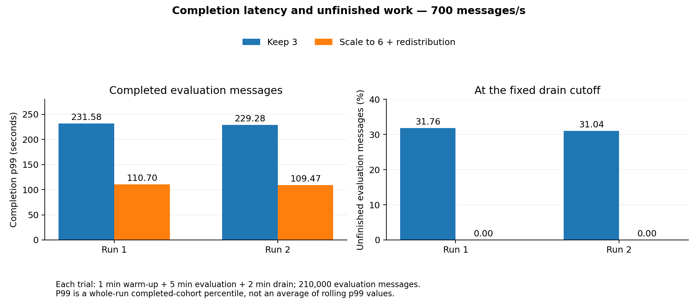
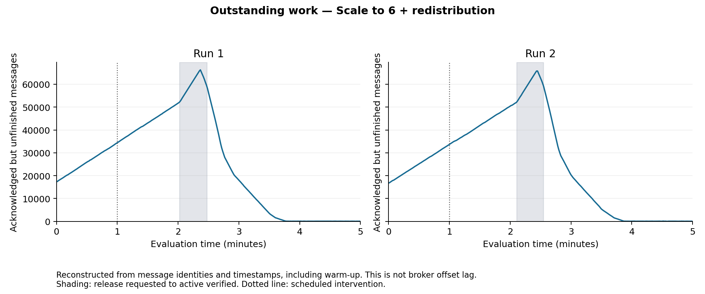

# Observed intervention costs

Treatment: Scale to 6 + redistribution. Cost criteria are post-hoc for this block. Cross-host timestamps have clock-probe uncertainty, so durations are approximate.

| Metric | Run 1 | Run 2 |
|---|---:|---:|
| No application-processing interval observed (s) | 20.2 | 20.0 |
| No completion interval (s) | 20.2 | 20.0 |
| Handoff coordination (s) | 27.0 | 26.5 |
| Net additional acknowledged-but-unfinished messages during coordination | 7,127.0 | 7,356.0 |
| Additional acknowledged-but-unfinished messages during processing gap | 14,143.0 | 13,992.0 |

Run 1: recovery to at most 100 processing-backlog offsets starts 90.4 seconds after the resume request and is confirmed after 120.4 seconds, requiring 30 seconds of continuous valid low-backlog observations.

Run 2: recovery to at most 100 processing-backlog offsets starts 87.7 seconds after the resume request and is confirmed after 117.7 seconds, requiring 30 seconds of continuous valid low-backlog observations.

**Processing interruption:** Gap between the last pre-resume completion and first post-resume processing start across all consumers; verified that no logged application processing interval intersects the gap. It is not pod downtime.

**Transition backlog:** Distinct messages with producer acknowledgment callback timestamp <= t and completion timestamp > t, including warm-up. Net change between release_requested and active_verified. This reconstructs acknowledged-but-unfinished work, not exact broker offset lag; callback delay and inter-host clock uncertainty affect boundary counts.

**Recovery:** First valid total processing-backlog observation <= 100 offsets that remains <= 100 for at least 30 seconds of consecutive observations, no gaps >3 seconds or owner/offset resets. Measured from resume_requested, during continuing production only. 50/200 thresholds supplied as post-hoc sensitivity, not pre-registered criteria.

**Interpretation:** Observed Scale to 6 + redistribution overhead, not a causal estimate of excess backlog. Cross-host timestamps have the saved clock-probe uncertainty; report durations approximately.

The reconstructed message curve fills the monitoring gap using separate event evidence; it does not replace or interpolate missing lag observations. Recovery uses actual valid processing-backlog monitoring, not that reconstructed curve. Warm-up work is included in outstanding work. Counts are observed changes, not the number of messages that would have accumulated under a hypothetical no-action counterfactual.

[Machine-readable results and sensitivity](intervention-cost.json)

