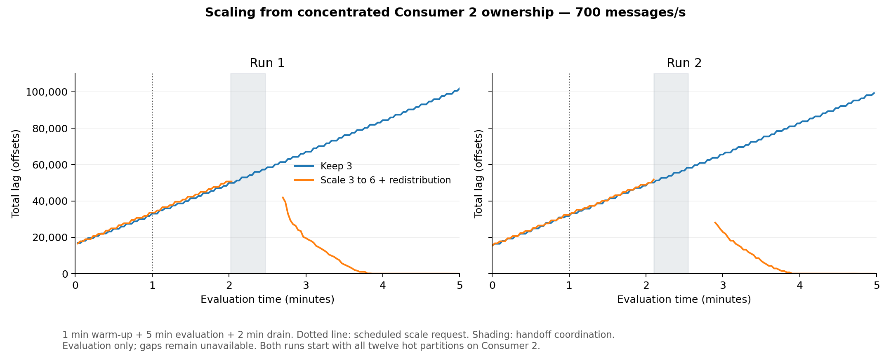
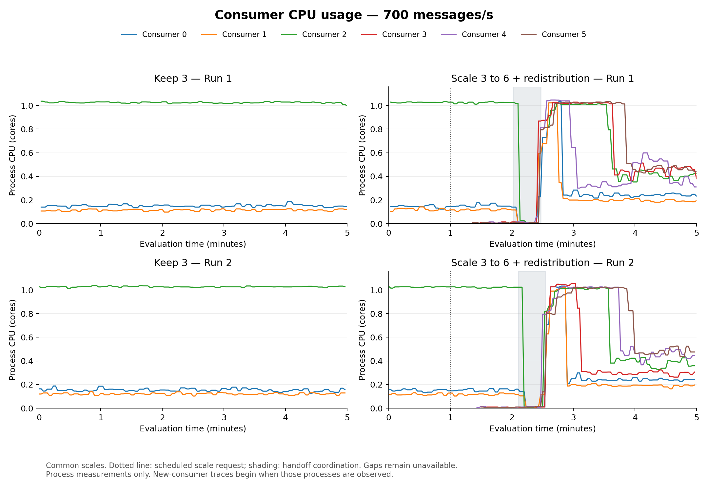
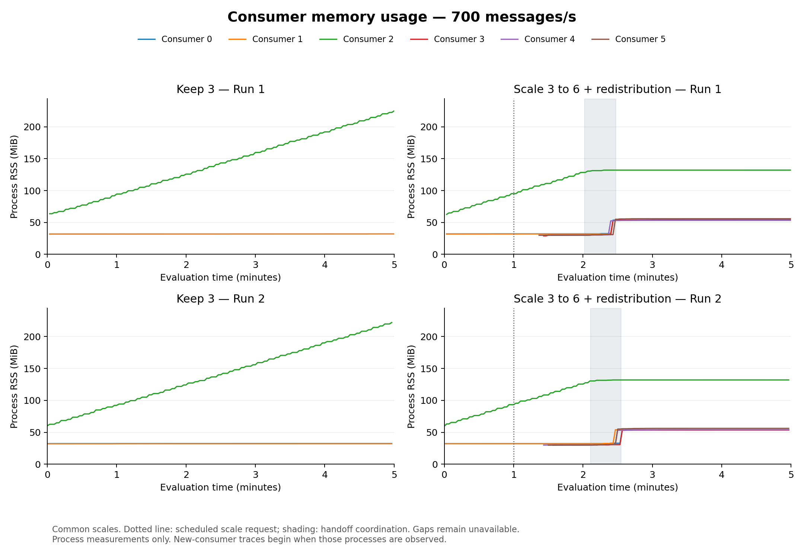
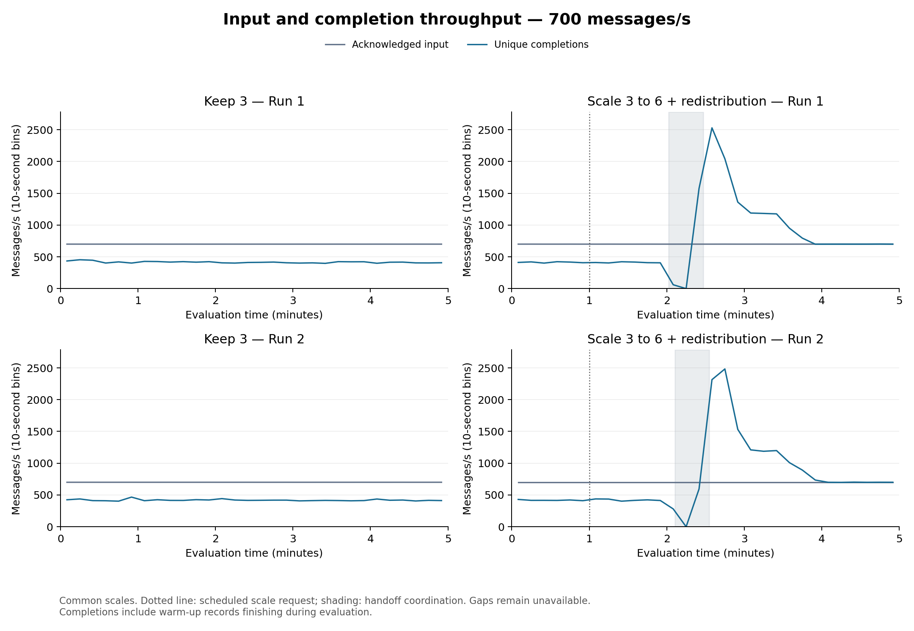
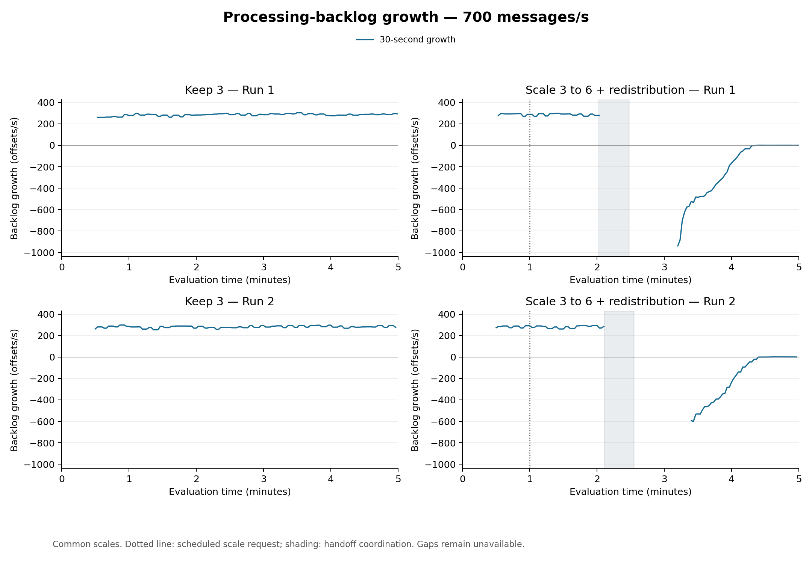
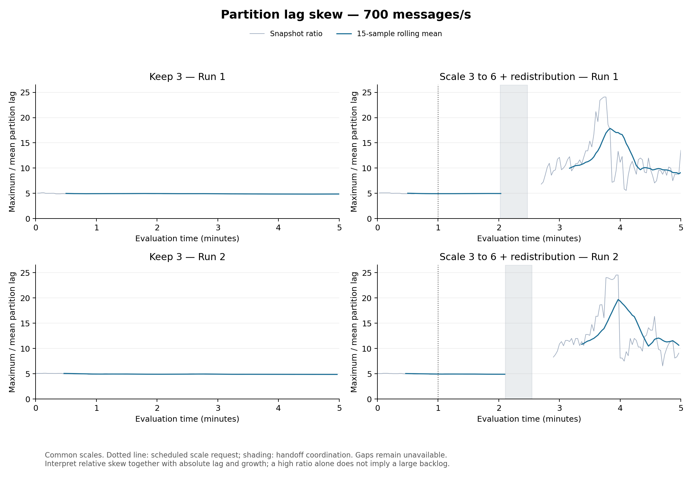

# Scaling from concentrated Consumer 2 ownership

Four performance trials used the same 700 msg/s aggregate 80/20 input and verified starting ownership. Each lasted eight minutes (one warm-up, five evaluation, two drain). Every run started with twelve hot partitions on Consumer 2. Scaling requested six replicas at evaluation +60 seconds and redistributed two hot and eight cold partitions to each. The short technical validation is separate from the performance count.

| Run | Condition | Completion p99 (s) | Unfinished | Mean lag | Peak lag | Useful throughput (msg/s) |
|---|---|---:|---:|---:|---:|---:|
| 1 | Keep 3 | 231.580 | 31.760% | 58516.8 | 101,938 | 415.93 |
| 1 | Scale 3 to 6 + redistribution | 110.695 | 0.000% | 19437.7 | 50,671 | 757.32 |
| 2 | Keep 3 | 229.280 | 31.037% | 57077.0 | 99,351 | 418.90 |
| 2 | Scale 3 to 6 + redistribution | 109.470 | 0.000% | 19473.2 | 51,721 | 755.63 |

Both conditions admitted 210,000 evaluation messages per trial. The results below compare separate trials; each arrow runs from keep-three to scale-and-redistribute.

- Run 1: completion p99 **231.58 → 110.70 s**; unfinished **31.76% → 0.00%**.
- Run 2: completion p99 **229.28 → 109.47 s**; unfinished **31.04% → 0.00%**.

| Run | Condition | Observed requested CPU (core-min) | Observed requested memory (GiB-min) | Resource coverage | Lag coverage |
|---|---|---:|---:|---:|---:|
| 1 | Keep 3 | 42.00 | 21.00 | 100.0% | 99.3% |
| 1 | Scale 3 to 6 + redistribution | 76.70 | 38.35 | 100.0% | 86.0% |
| 2 | Keep 3 | 33.75 | 16.87 | 80.4% | 99.3% |
| 2 | Scale 3 to 6 + redistribution | 76.81 | 38.40 | 100.0% | 83.3% |

Requested resources are integrated over observed intervals within five evaluation minutes plus two drain minutes. Partial coverage produces a partial integral, not the full cost. They describe reserved consumer resources, not measured consumption or whole-cluster cost. CPU and RSS plots show process measurements separately. Useful throughput counts distinct completions during evaluation, including warm-up messages completing then; it may therefore exceed the 700 msg/s input target while queued work is cleared.

The identity and offset checks passed for all four trials, with no duplicate completion identifiers, duplicate completed offsets or unmatched completion identities. Both intervention trials passed release, acquire and resume verification. This validates the recorded synthetic-workload handoffs; it does not establish exactly-once external application effects.

All original producer and consumer pods, machines, resource settings and starting ownership matched the saved reference. New consumers were placed by Kubernetes. The earlier fixed-three distributed layout also completed its workload, so these findings do not establish that six consumers were necessary: moving hot partitions away from the overloaded owner without scaling remains a separate next comparison.

The final keep-three trial finished on schedule, but its first monitoring export failed after the local Prometheus connection closed. The retained historical measurements were recovered through a new connection, and all analyses and identity checks then passed. No workload was rerun and the outcome-summary hash stayed unchanged. The independent local resource observer has only 80.4% coverage for that trial, so its reported request integrals are partial and must not be compared as full-run resource costs. Its evaluation lag coverage is 99.3%. The failed collection attempt is preserved in collection-recovery.json and the raw campaign records.

P99 is the nearest-rank percentile of completed evaluation messages through application completion, before commit acknowledgment. It is not an average of rolling p99 values. Mean lag is time-weighted over valid intervals. Missing observations and ownership transitions break plotted lines. Unfinished messages are counted at the fixed drain cutoff; warm-up messages remain queued but are excluded from that cohort.

The comparison tests added replicas and a predeclared assignment change together. A redistribution-only arm would be needed to isolate the value of extra capacity. Original pods, resources and initial owners were checked against one fixed reference; added pods were not pinned. Two runs per condition do not establish long-term stability or remove shared-machine variability.

Full metric definitions, configuration, process CPU/RSS, deadline outcomes, growth windows, request integrals, coverage, transition timing, identity checks and source-evidence hashes are retained in comparison.json. Large raw evidence remains in the separate results storage.

[All comparison plots](c2-scaling-metrics.pdf)

