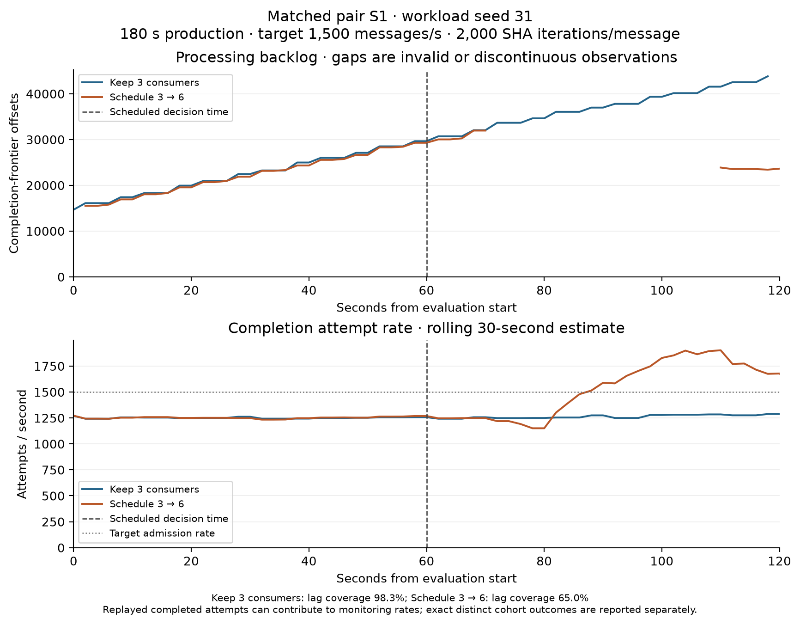
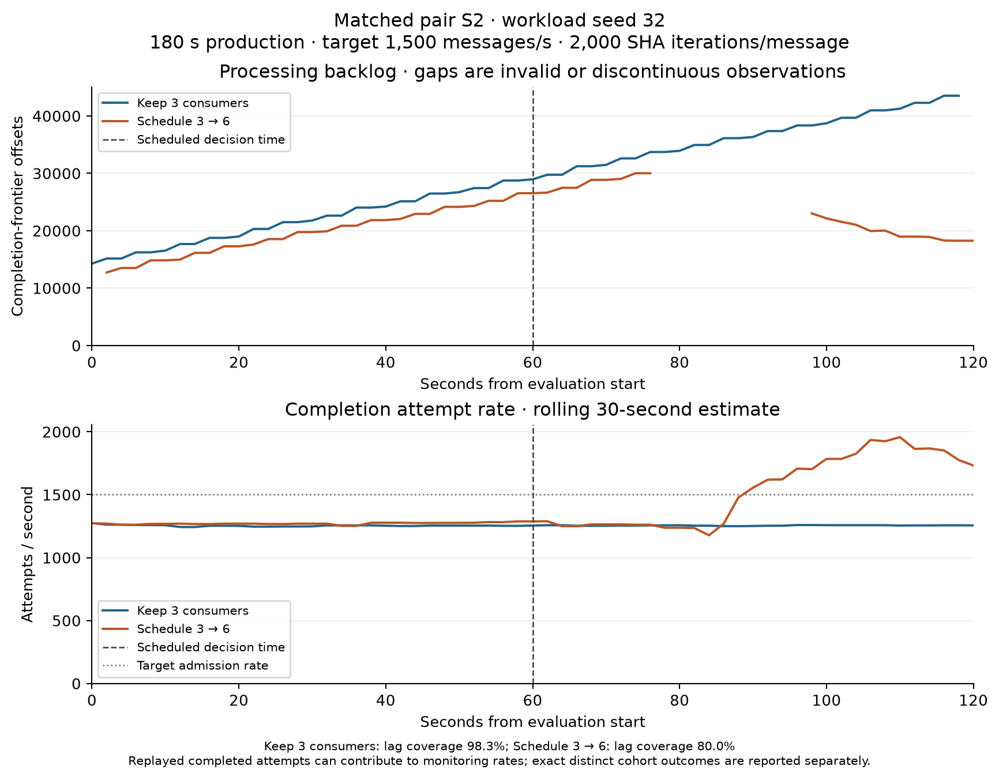
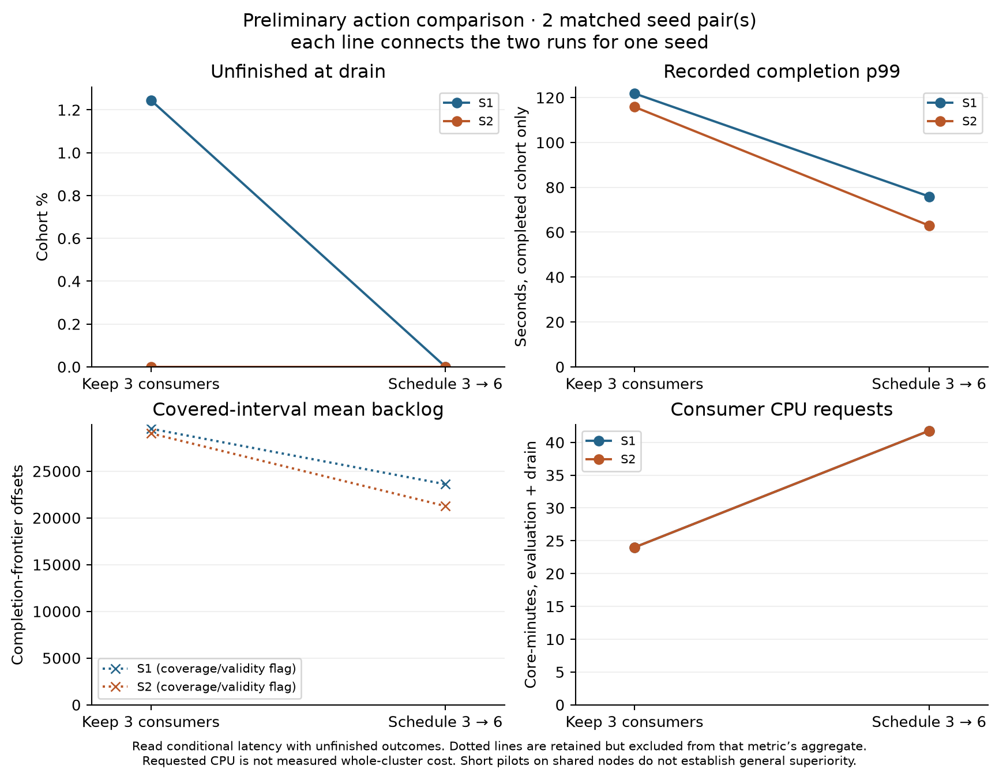

# Preliminary action comparison

Status: **complete_predeclared_family**. Each pair below uses its own matched workload seed. Short, sustained and isolated-partition episodes are analyzed separately.

## Pair S1 — seed 31

Keep three consumers: `run-20260912-071918`. Schedule three to six: `run-20260912-072753`.

| Measure | Keep 3 | Schedule 3 → 6 |
|---|---:|---:|
| Distinct evaluation admissions | 180,000 | 180,000 |
| Unfinished at drain | 2,241 | 0 |
| Unfinished fraction (%) | 1.245 | 0.000 |
| Recorded completed-cohort mean (s) | 30.752 | 18.731 |
| Recorded completed-cohort p99 (s) | 121.822 | 75.918 |
| Admissions / evaluation second | 1,500.000 | 1,500.000 |
| Unique in-evaluation completions / second | 1,258.400 | 1,435.467 |
| Covered-interval mean processing backlog (offsets) | 29,541.5 | 23,600.0 |
| Lag coverage (%) | 98.33 | 65.00 |
| Requested consumer CPU (core-minutes, evaluation + drain) | 24.000 | 41.773 |
| Resource coverage for that horizon (%) | 100.00 | 100.00 |

Compatibility checks: passed (workload configuration, action settings and recorded application/Python/package signatures). Both full message-outcome evidence checks passed: True.
Keep 3 quality flags: none at the predeclared coverage screens. Recovery: `{"censored": true, "followup_seconds": 60.0, "hold_seconds": 20, "seconds_to_confirmation": null, "status": "not_observed_by_evaluation_end", "threshold_offsets": 1500}`.
Scale quality flags: Lag coverage below 90%; transition gaps remain part of the result. Recovery: `{"censored": true, "followup_seconds": 60.0, "hold_seconds": 20, "seconds_to_confirmation": null, "status": "not_observed_by_evaluation_end", "threshold_offsets": 1500}`.

| New consumer | Node | Request → Kubernetes Ready (s) | Request → first recorded completion (s) |
|---|---|---:|---:|
| consumer-sts-3 | k8s-ravi-01.calit2.optiputer.net | 10.54 | 13.02 |
| consumer-sts-4 | k8s-gpu-01.calit2.optiputer.net | 7.54 | 9.97 |
| consumer-sts-5 | k8s-chase-ci-07.calit2.optiputer.net | 15.54 | 17.17 |

## Pair S2 — seed 32

Keep three consumers: `run-20260912-082113`. Schedule three to six: `run-20260912-081218`.

| Measure | Keep 3 | Schedule 3 → 6 |
|---|---:|---:|
| Distinct evaluation admissions | 180,000 | 180,000 |
| Unfinished at drain | 0 | 0 |
| Unfinished fraction (%) | 0.000 | 0.000 |
| Recorded completed-cohort mean (s) | 31.050 | 15.740 |
| Recorded completed-cohort p99 (s) | 115.817 | 62.936 |
| Admissions / evaluation second | 1,500.000 | 1,500.000 |
| Unique in-evaluation completions / second | 1,252.750 | 1,462.233 |
| Covered-interval mean processing backlog (offsets) | 29,041.7 | 21,262.2 |
| Lag coverage (%) | 98.33 | 80.00 |
| Requested consumer CPU (core-minutes, evaluation + drain) | 24.000 | 41.781 |
| Resource coverage for that horizon (%) | 100.00 | 100.00 |

Compatibility checks: passed (workload configuration, action settings and recorded application/Python/package signatures). Both full message-outcome evidence checks passed: True.
Keep 3 quality flags: none at the predeclared coverage screens. Recovery: `{"censored": true, "followup_seconds": 60.0, "hold_seconds": 20, "seconds_to_confirmation": null, "status": "not_observed_by_evaluation_end", "threshold_offsets": 1500}`.
Scale quality flags: Lag coverage below 90%; transition gaps remain part of the result. Recovery: `{"censored": true, "followup_seconds": 60.0, "hold_seconds": 20, "seconds_to_confirmation": null, "status": "not_observed_by_evaluation_end", "threshold_offsets": 1500}`.

| New consumer | Node | Request → Kubernetes Ready (s) | Request → first recorded completion (s) |
|---|---|---:|---:|
| consumer-sts-3 | k8s-chase-ci-07.calit2.optiputer.net | 14.52 | 17.27 |
| consumer-sts-4 | k8s-gpu-01.calit2.optiputer.net | 12.52 | 15.18 |
| consumer-sts-5 | k8s-ravi-01.calit2.optiputer.net | 14.52 | 17.32 |

## Descriptive differences across matched seeds

Each difference is scale minus keep-3 for one matched seed. Means and sample standard deviations below summarize these paired run-level differences; they do not pool message latencies. Coverage screens apply separately to each metric.

| Measure | Eligible pairs | Mean paired difference | Minimum | Maximum | Sample SD |
|---|---:|---:|---:|---:|---:|
| Unfinished fraction (%) | 2 | -0.622 | -1.245 | 0.000 | 0.880 |
| Recorded completed-cohort mean (s) | 2 | -13.666 | -15.310 | -12.021 | 2.326 |
| Recorded completed-cohort p99 (s) | 2 | -49.393 | -52.881 | -45.904 | 4.933 |
| Unique in-evaluation completions / second | 2 | 193.275 | 177.067 | 209.483 | 22.922 |
| Covered-interval mean processing backlog (offsets) | 0 | Unavailable | Unavailable | Unavailable | Unavailable |
| Requested consumer CPU (core-minutes, evaluation + drain) | 2 | 17.777 | 17.773 | 17.781 | 0.006 |

Unfinished-fraction differences are percentage points. With one pair, sample SD is unavailable; with two, it is only a descriptive spread estimate. No confidence interval or significance test is claimed.

## Interpretation limits

Completed-message mean and percentiles are conditional on completion by the fixed drain. Read them with unfinished counts; missing completion latency is never assigned zero. A run p99 or mean of run p99 values is not a pooled-message percentile.
Backlog integrals and means cover only eligible observed intervals. Missing or ownership-transition intervals are not zero, and different coverage can affect the comparison. The displayed offset backlog is not the unique unfinished cohort count.
Cost here is requested consumer-container CPU time, with a common evaluation-through-drain horizon. It is not measured whole-cluster CPU use or a billing total. Startup timing mixes coordinator, Kubernetes and application timestamps; clock and sampling uncertainty remain.
A threshold-hold confirmation means recovery from overload only when backlog was initially above the threshold. In an already healthy low-input trial it is a health check; missing transition observations do not establish failed recovery.
These are short preliminary scheduled-action comparisons on shared nodes, not a tuned HPA evaluation or a completed adaptive-selector study. Ordinary initial assignments and node placements are recorded, not forced equal. Two seed pairs do not justify a strong confidence interval or broad causal/general superiority claim.
Earlier guard-interrupted and pre-production diagnostics remain retained separately. The 99 ms threshold is provisional and the clock probes do not establish its accuracy as an SLA test.

Raw per-message evidence remains under the active code results directory and on Nautilus PVCs. The individual Git run records include evidence hashes, configurations, outcomes, source provenance and monitoring plots. This summary does not replace the raw evidence backup.
