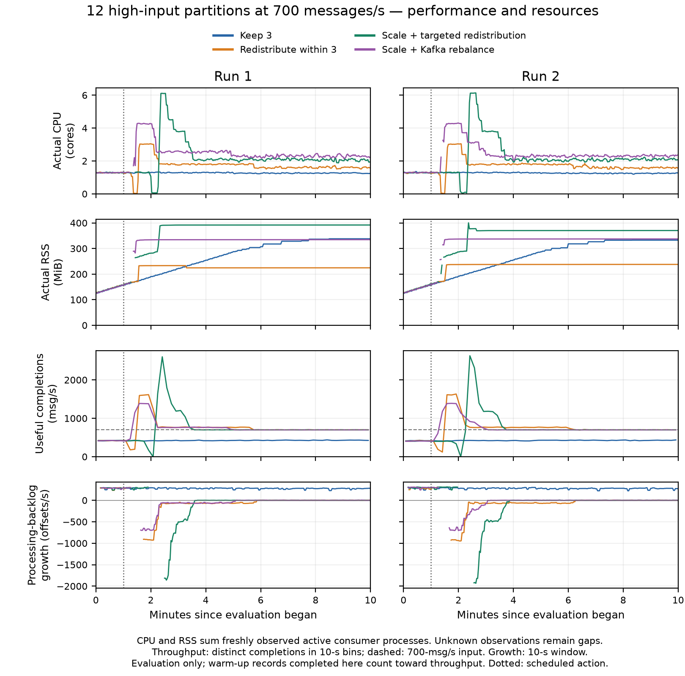

# Twelve hot partitions: eight trials

Each trial used 700 aggregate messages/s, sixty partitions, and one-minute warm-up, ten-minute evaluation and two-minute drain. The action was scheduled one minute into evaluation. Each response has two separate trials with verified matching starting conditions.

| Response | p99 Run 1 / Run 2 (s) | Unfinished Run 1 / Run 2 (%) |
|---|---:|---:|
| Keep three | 366.64 / 362.79 | 34.64 / 34.83 |
| Redistribute within three | 80.10 / 84.16 | 0.00 / 0.00 |
| Targeted scaling to six | 100.81 / 107.24 | 0.00 / 0.00 |
| Native Kafka scaling to six | 71.41 / 72.46 | 0.00 / 0.00 |

All three interventions completed every evaluation message in both runs; keeping the initial assignment left about 35% unfinished. Native scaling recorded the lowest whole-cohort p99 in this block. Redistribution used fewer requested consumer resources than scaling. The first baseline has insufficient resource-request coverage for a full-window requested-cost comparison; its cost is unavailable, not zero. Coordination mechanisms differ between native and targeted responses.

[Original numerical comparison and provenance](comparison.json) · [Late-cohort analysis](post-recovery-comparison.json) · [Detailed metrics and plots](../result-metric-audit-20260930/README.md) · [Protocol](../../experiments/four-condition-20260929/README.md)

P99 covers completed evaluation messages through the fixed drain cutoff, before commit acknowledgment. Unfinished percentage uses all acknowledged evaluation messages. Small repetition counts and shared-machine variability limit generalization.
