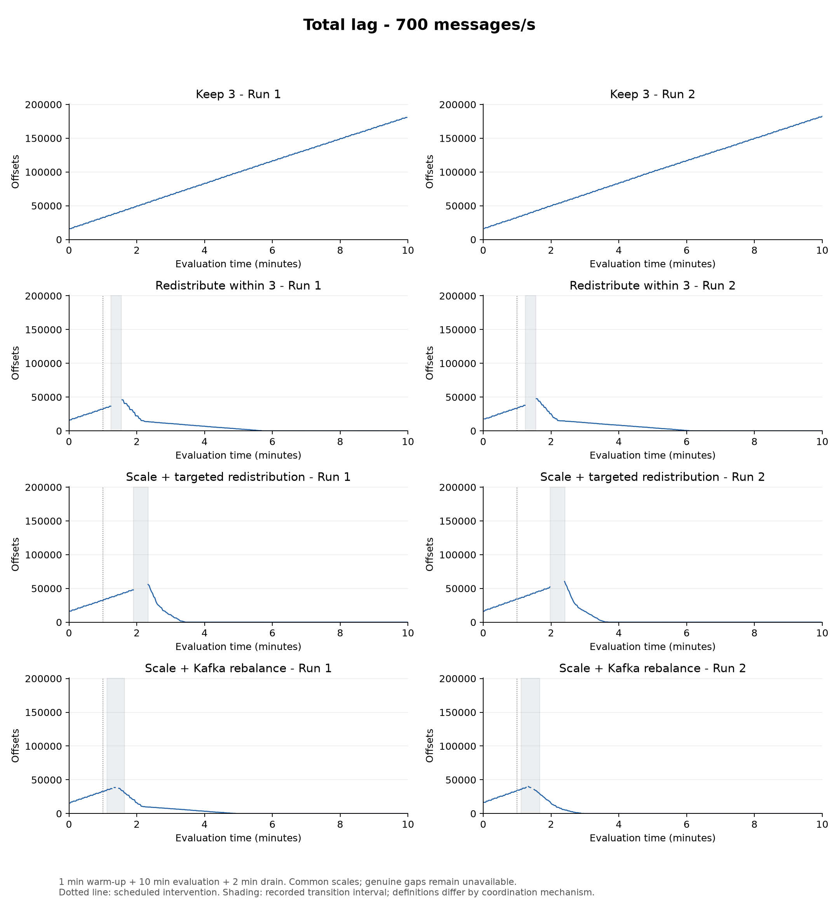
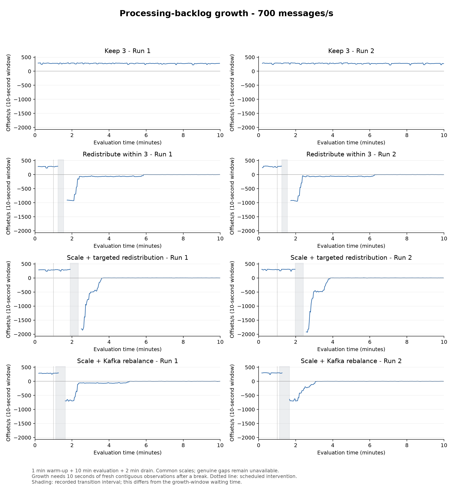
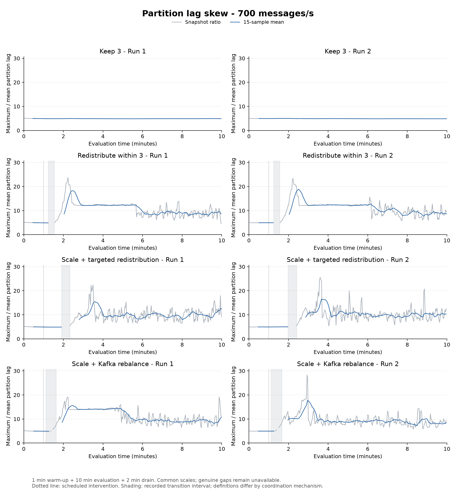
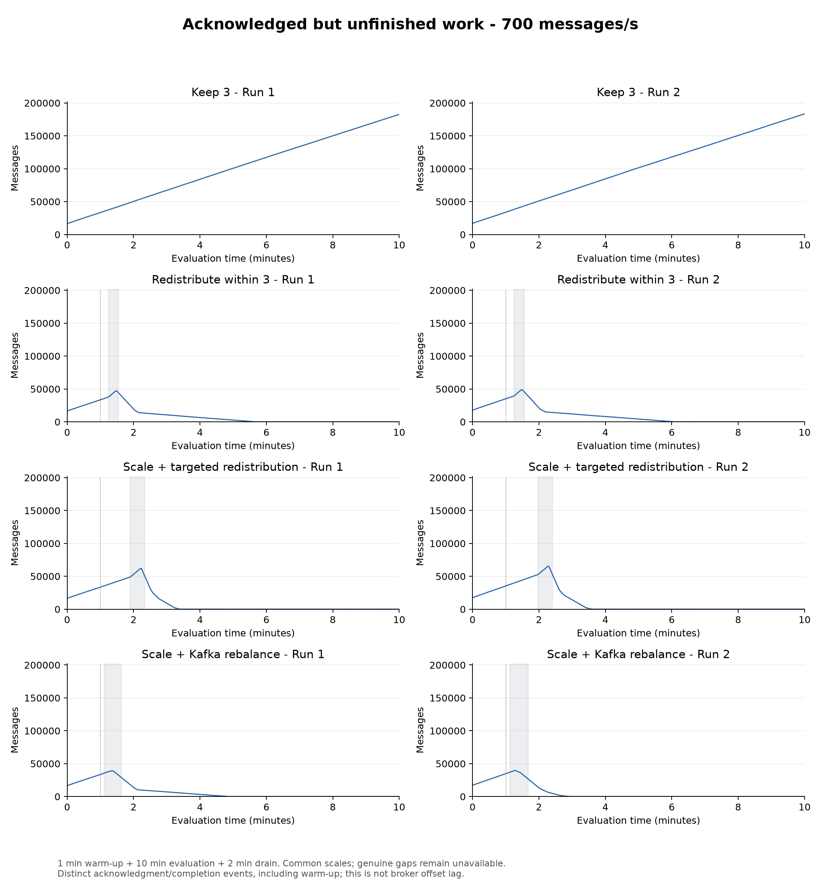
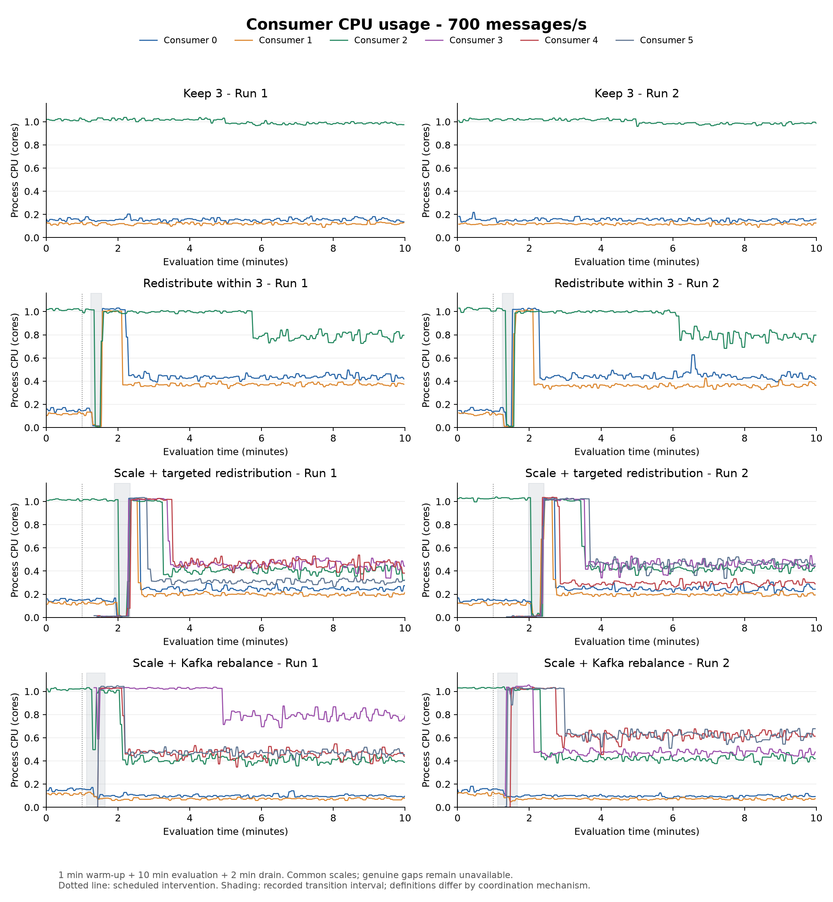
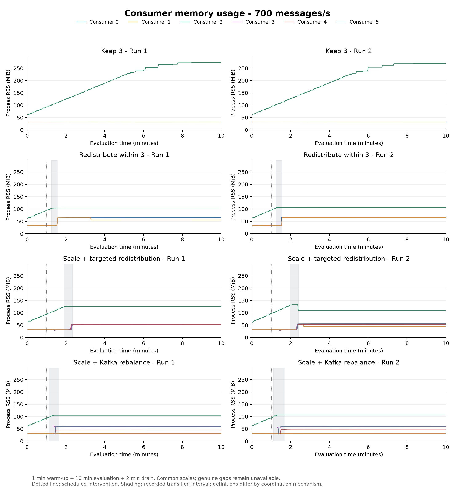
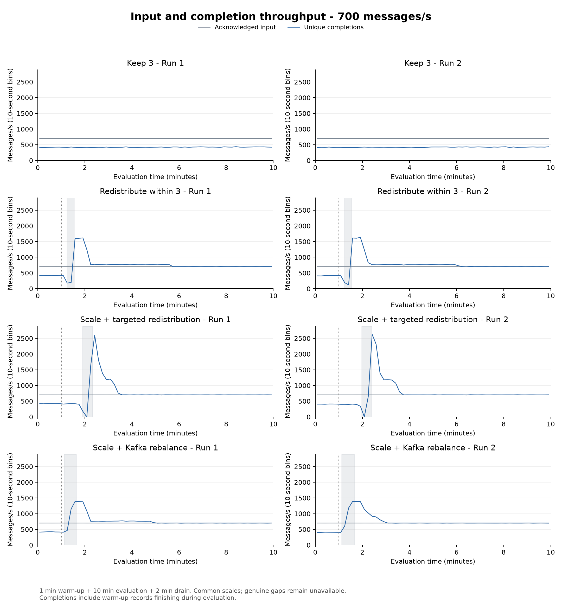
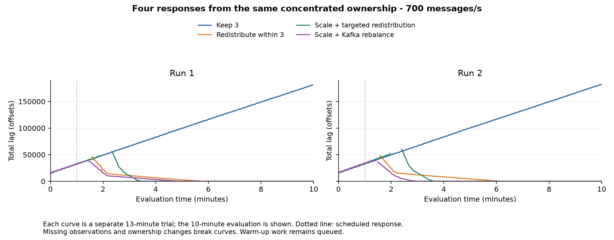
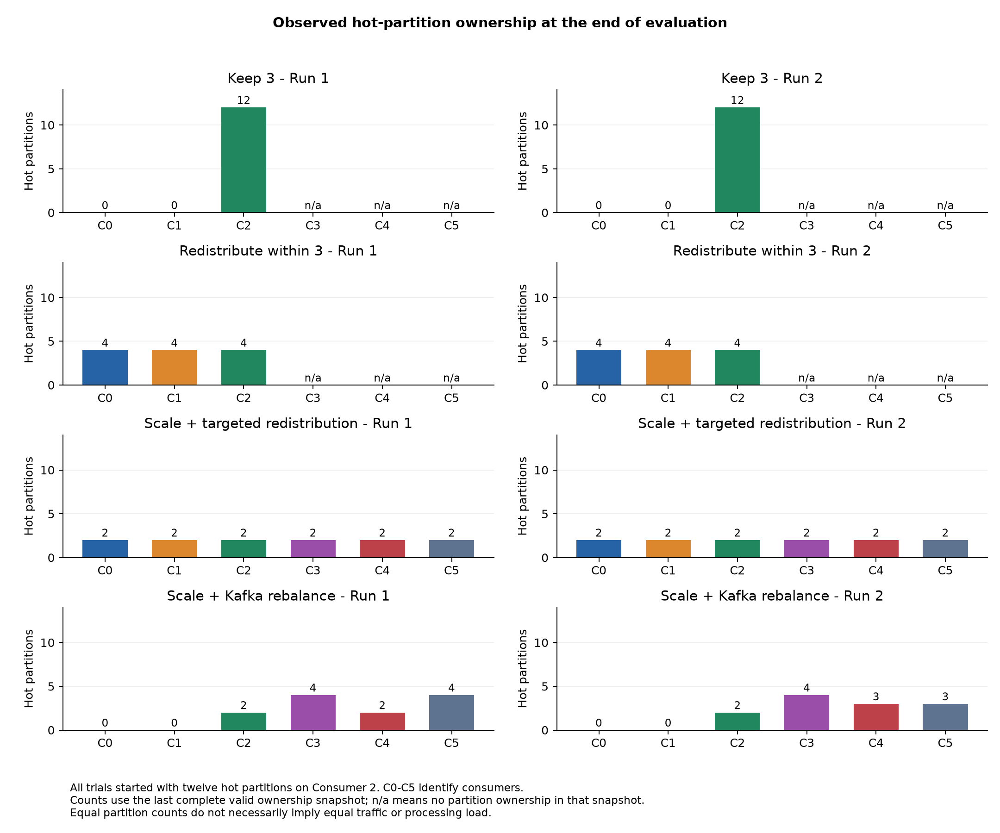
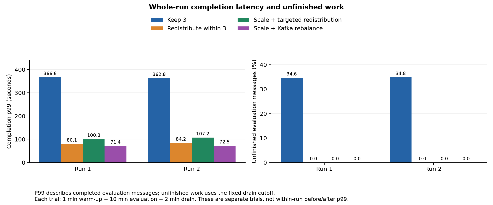

# Four responses to concentrated ownership

Eight performance trials used a common verified starting map, all twelve hot partitions on Consumer 2, and 700 aggregate messages/s. Every trial lasted thirteen minutes: one warm-up, ten evaluation and two drain. The second run reversed condition order.

| Condition | Run | Completion p99 (s) | Unfinished (%) | Useful completions/s | Mean lag | Lag coverage |
|---|---:|---:|---:|---:|---:|---:|
| Keep 3 | 1 | 366.64 | 34.641 | 423.23 | 98,929.4 | 99.7% |
| Keep 3 | 2 | 362.79 | 34.828 | 422.62 | 100,032.7 | 99.7% |
| Redistribute within 3 | 1 | 80.10 | 0.000 | 727.71 | 7,837.4 | 96.3% |
| Redistribute within 3 | 2 | 84.16 | 0.000 | 729.53 | 8,664.0 | 96.3% |
| Scale + targeted redistribution | 1 | 100.81 | 0.000 | 727.75 | 8,470.4 | 95.3% |
| Scale + targeted redistribution | 2 | 107.24 | 0.000 | 729.31 | 9,520.4 | 95.3% |
| Scale + Kafka rebalance | 1 | 71.41 | 0.000 | 727.65 | 6,687.5 | 98.0% |
| Scale + Kafka rebalance | 2 | 72.46 | 0.000 | 728.48 | 5,702.1 | 98.0% |

P99 is calculated from distinct acknowledged evaluation messages that completed by the drain cutoff; it is not an average of rolling percentiles. Warm-up messages remain queued but are outside that latency cohort. Useful completion throughput includes warm-up work finishing during evaluation.

The growth figure uses a 10-second window (5 intervals at the 2-second export step), recomputed from saved observations. It restarts after missing observations, ownership changes or offset resets. This display setting does not change the 15-snapshot skew mean, whole-run results, or the separate 30-second recovery hold. Earlier figures retain their original window settings.

| Condition | Run | Observed requested CPU (core-min) | Observed requested memory (GiB-min) | Request coverage |
|---|---:|---:|---:|---:|
| Keep 3 | 1 | 1.22 | 0.61 | 1.7% |
| Keep 3 | 2 | 72.00 | 36.00 | 100.0% |
| Redistribute within 3 | 1 | 72.00 | 36.00 | 100.0% |
| Redistribute within 3 | 2 | 72.00 | 36.00 | 100.0% |
| Scale + targeted redistribution | 1 | 136.86 | 68.43 | 100.0% |
| Scale + targeted redistribution | 2 | 136.80 | 68.40 | 100.0% |
| Scale + Kafka rebalance | 1 | 137.15 | 68.58 | 100.0% |
| Scale + Kafka rebalance | 2 | 137.15 | 68.57 | 100.0% |

Requested resources are integrated over evaluation plus drain; actual process CPU/RSS are retained separately. Missing intervals are excluded, not treated as zero.

| Condition | Run | Transition (s) | Net additional unfinished messages | Recovery confirmed after decision (s) |
|---|---:|---:|---:|---:|
| Redistribute within 3 | 1 | 18.51 | 6,808 | 305.2 |
| Redistribute within 3 | 2 | 18.56 | 6,581 | 328.9 |
| Scale + targeted redistribution | 1 | 25.98 | 2,082 | 169.0 |
| Scale + targeted redistribution | 2 | 26.05 | 548 | 184.9 |
| Scale + Kafka rebalance | 1 | 31.01 | -6,777 | 259.0 |
| Scale + Kafka rebalance | 2 | 33.01 | -9,823 | 143.0 |

| Condition | Run | Longest observed interval without application processing during transition (s) |
|---|---:|---:|
| Redistribute within 3 | 1 | 14.544 |
| Redistribute within 3 | 2 | 14.400 |
| Scale + targeted redistribution | 1 | 19.498 |
| Scale + targeted redistribution | 2 | 19.049 |
| Scale + Kafka rebalance | 1 | 0.092 |
| Scale + Kafka rebalance | 2 | 0.202 |

This interval is calculated from the union of application-processing intervals across all consumers. A near-zero value means some consumer continued processing; it does not establish uninterrupted service for every partition. Explicit handover pause durations are also retained separately in comparison.json.

Explicit transition time spans release request through active verification. Native scaling spans the scale decision through ten seconds of complete stable six-owner observations. These are different operational boundaries and must not be interpreted as identical coordination costs. Message accumulation is reconstructed from acknowledgment/completion timestamps and includes warm-up. It is an observed net change, not causal excess relative to a counterfactual.

Recovery requires total processing backlog at most 100 offsets for thirty consecutive valid seconds with no ownership or offset reset, while production continues. Sensitivity thresholds of 50 and 200 offsets were specified in advance. Per-partition native handover intervals and verified explicit processing pauses are in comparison.json. A cold partition can be naturally idle between records, so its inter-owner message interval is not pure rebalance downtime.

The normal Kafka arm uses classic cooperative-sticky assignment with per-pod static identities. Other arms use coordinated explicit ownership. This comparison evaluates those implemented responses, including coordination differences. All were scheduled, not selected by an adaptive controller. Two runs and shared-node variability limit generalization. Historical monitoring exports remain unchanged.

[Full results, definitions and evidence hashes](comparison.json) · [All plots](four-condition-metrics.pdf)

The Mac coordinating baseline Run 1 slept for fifteen minutes. Nautilus continued the configured workload and cutoff. Historical Prometheus data were recovered without rerunning traffic or changing cohort results; local resource-request observations during sleep remain unavailable. The baseline is retained once, with its partial request integral and coverage reported. Subsequent trials used a stronger temporary system-sleep assertion on AC power.

