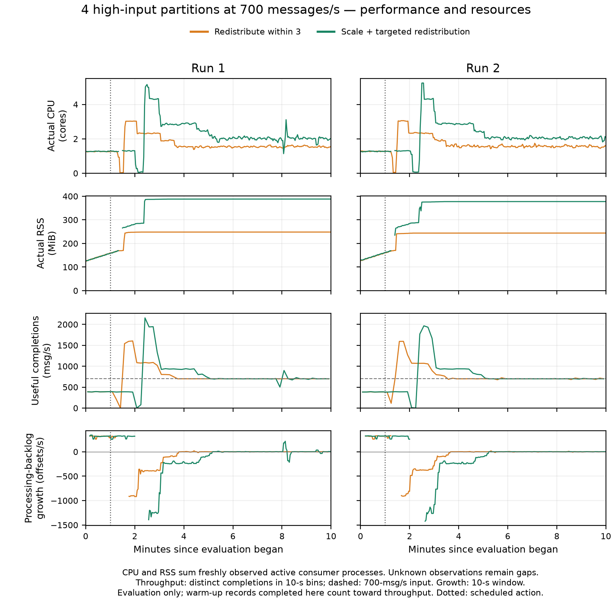

# Four hot partitions: four trials

Each trial used 700 aggregate messages/s, sixty partitions, and one-minute warm-up, ten-minute evaluation and two-minute drain. The action was scheduled one minute into evaluation. Each response has two separate trials with verified matching starting conditions.

| Response | p99 Run 1 / Run 2 (s) | Unfinished Run 1 / Run 2 (%) |
|---|---:|---:|
| Redistribute within three | 84.50 / 79.28 | 0.00 / 0.00 |
| Targeted scaling to six | 110.19 / 112.94 | 0.00 / 0.00 |

Both responses completed every evaluation message. Redistribution within three consumers recorded lower whole-cohort p99 and used fewer requested consumer resources in both runs. The first targeted-scaling trial also had a later backlog spike. This block does not include a no-action baseline or native Kafka scaling, and the tested assignment is not proven optimal.

[Original numerical comparison and provenance](comparison.json) · [Late-cohort analysis](late-cohort-comparison.json) · [Detailed metrics and plots](../result-metric-audit-20260930/README.md) · [Protocol](../../experiments/four-hot-partitions-20260930/README.md)

P99 covers completed evaluation messages through the fixed drain cutoff, before commit acknowledgment. Unfinished percentage uses all acknowledged evaluation messages. Small repetition counts and shared-machine variability limit generalization.
