# Responses to concentrated ownership

4 performance trials used a common verified starting map, all 4 hot partitions on Consumer 2, and 700 aggregate messages/s. Every trial lasted thirteen minutes: one warm-up, ten evaluation and two drain. The second run reversed condition order.

Both responses completed all **420,000 evaluation messages per trial** and met the declared recovery criterion while input continued. Redistribution within three had lower whole-run p99 and fewer one-second deadline misses in both repetitions. It used **72 requested CPU core-minutes**, compared with **136.83–136.85** for the six-consumer response. This is evidence that the implemented three-consumer redistribution was sufficient for these observed conditions; it does not establish that scaling cannot help under other conditions.

Recovery was confirmed **173.45–180.85 seconds after the action decision** with three, compared with **266.80–290.54 seconds** with six. Decision-to-active time was **21.92–27.26 seconds** versus **78.52–81.26 seconds**. The shorter global processing pauses were **12.31–15.08 seconds** versus **19.88–21.73 seconds**. Preparation, processing interruption and recovery are separate intervals. Replica count, assignment, enrollment and shared-machine effects are not isolated by this comparison.

**Persistent hotspots were present before intervention in every trial.** The [timing table](LATE_COHORT.md#when-persistent-hotspots-were-observed) separates the whole evaluation from minutes 8–10. Some small persistent hotspots remained in that late window in this four-partition block. The [earlier twelve-partition comparison](../four-condition-20260929/POST_RECOVERY.md#persistent-hotspots-before-the-late-window) instead had zero at every defined snapshot in minutes 8–10; that zero never described its whole experiment. For example, the present three-consumer Run 1 still classified Partition 8 as persistently hot near the end with only 11 offsets of lag and 42 total. Persistent relative imbalance is not automatically persistent overload.

The [prespecified late production cohort](LATE_COHORT.md) reports p99 of **0.187 and 0.349 seconds** with three, versus **2.714 and 0.481 seconds** with six, with no unfinished late-cohort messages. The first six-consumer trial had a later backlog spike after initially satisfying recovery. Reaching the recovery criterion once does not establish that backlog stayed continuously below it. Whole-run outcomes remain primary.

| Condition | Run | Completion p99 (s) | Unfinished (%) | Useful completions/s | Mean lag | Lag coverage |
|---|---:|---:|---:|---:|---:|---:|
| Redistribute within 3 | 1 | 84.50 | 0.000 | 730.87 | 7,295.7 | 96.3% |
| Redistribute within 3 | 2 | 79.28 | 0.000 | 731.38 | 6,994.1 | 97.0% |
| Scale + targeted redistribution | 1 | 110.19 | 0.000 | 730.89 | 12,683.4 | 95.7% |
| Scale + targeted redistribution | 2 | 112.94 | 0.000 | 731.13 | 12,739.5 | 95.0% |

P99 is calculated from distinct acknowledged evaluation messages that completed by the drain cutoff; it is not an average of rolling percentiles. Warm-up messages remain queued but are outside that latency cohort. Useful completion throughput includes warm-up work finishing during evaluation.

The growth figure uses a 10-second window (5 intervals at the 2-second export step), recomputed from saved observations. It restarts after missing observations, ownership changes or offset resets. This display setting does not change the 15-snapshot skew mean, whole-run results, or the separate 30-second recovery hold. Earlier figures retain their original window settings.

| Condition | Run | Observed requested CPU (core-min) | Observed requested memory (GiB-min) | Request coverage |
|---|---:|---:|---:|---:|
| Redistribute within 3 | 1 | 72.00 | 36.00 | 100.0% |
| Redistribute within 3 | 2 | 72.00 | 36.00 | 100.0% |
| Scale + targeted redistribution | 1 | 136.83 | 68.42 | 100.0% |
| Scale + targeted redistribution | 2 | 136.85 | 68.42 | 100.0% |

Requested resources are integrated over evaluation plus drain; actual process CPU/RSS are retained separately. Missing intervals are excluded, not treated as zero.

| Condition | Run | Decision to verified active/stable (s) | Handover transition (s) | Net additional unfinished messages | Recovery confirmed after decision (s) |
|---|---:|---:|---:|---:|---:|
| Redistribute within 3 | 1 | 27.26 | 19.39 | 7,023 | 180.9 |
| Redistribute within 3 | 2 | 21.92 | 15.80 | 6,019 | 173.4 |
| Scale + targeted redistribution | 1 | 78.52 | 26.47 | 4,678 | 290.5 |
| Scale + targeted redistribution | 2 | 81.26 | 28.37 | 5,523 | 266.8 |

| Condition | Run | Longest observed interval without application processing during transition (s) |
|---|---:|---:|
| Redistribute within 3 | 1 | 15.080 |
| Redistribute within 3 | 2 | 12.307 |
| Scale + targeted redistribution | 1 | 19.881 |
| Scale + targeted redistribution | 2 | 21.732 |

This interval is calculated from the union of application-processing intervals across all consumers. A near-zero value means some consumer continued processing; it does not establish uninterrupted service for every partition. Explicit handover pause durations are also retained separately in comparison.json.

For explicit actions, decision-to-active time includes preparation and any replica enrollment before release. Handover transition time spans release request through active verification; neither interval is identical to the processing pause. Native scaling spans the scale decision through ten seconds of complete stable six-owner observations. These are different operational boundaries and must not be interpreted as identical coordination costs. Message accumulation is reconstructed from acknowledgment/completion timestamps and includes warm-up. It is an observed net change, not causal excess relative to a counterfactual.

Recovery requires total processing backlog at most 100 offsets for thirty consecutive valid seconds with no ownership or offset reset, while production continues. Sensitivity thresholds of 50 and 200 offsets were specified in advance. Per-partition native handover intervals and verified explicit processing pauses are in comparison.json. A cold partition can be naturally idle between records, so its inter-owner message interval is not pure rebalance downtime.

Both performance conditions use coordinated explicit ownership. Native Kafka scaling is not a performance condition in this block. This comparison evaluates those implemented responses, including preparation and coordination. All were scheduled, not selected by an adaptive controller. Two runs and shared-node variability limit generalization. Historical monitoring exports remain unchanged.

[Full results, definitions and evidence hashes](comparison.json) · [All plots](four-condition-metrics.pdf)

## Completion deadline outcomes

Configured deadline: 1000 ms. The primary admitted-cohort miss rate includes late completions and unfinished messages whose deadlines elapsed. The observed-completion rate uses valid completion attempts occurring during evaluation, including warm-up records and replays; its denominator is different.

| Condition | Run | Primary cohort misses (%) | Observed completion violations (%) | Censored cohort deadlines |
|---|---:|---:|---:|---:|
| Redistribute within 3 | 1 | 26.63 | 29.75 | 0 |
| Redistribute within 3 | 2 | 25.82 | 29.01 | 0 |
| Scale + targeted redistribution | 1 | 35.23 | 37.98 | 0 |
| Scale + targeted redistribution | 2 | 34.72 | 37.51 | 0 |

Reporting deadlines were specified in the campaign protocol before the trials. The primary threshold is identified below; additional thresholds assess sensitivity to that choice. Balanced calibration does not establish an application requirement. Each row uses the same distinct admitted cohort and original observation cutoff; the rate includes overdue unfinished records.

| Condition | Run | Deadline (ms) | Role | Late completions | Overdue unfinished | Cohort misses (%) | Censored |
|---|---:|---:|---|---:|---:|---:|---:|
| Redistribute within 3 | 1 | 500 | Sensitivity | 113132 | 0 | 26.94 | 0 |
| Redistribute within 3 | 1 | 1000 | Primary | 111855 | 0 | 26.63 | 0 |
| Redistribute within 3 | 2 | 500 | Sensitivity | 111284 | 0 | 26.50 | 0 |
| Redistribute within 3 | 2 | 1000 | Primary | 108448 | 0 | 25.82 | 0 |
| Scale + targeted redistribution | 1 | 500 | Sensitivity | 151423 | 0 | 36.05 | 0 |
| Scale + targeted redistribution | 1 | 1000 | Primary | 147975 | 0 | 35.23 | 0 |
| Scale + targeted redistribution | 2 | 500 | Sensitivity | 147270 | 0 | 35.06 | 0 |
| Scale + targeted redistribution | 2 | 1000 | Primary | 145813 | 0 | 34.72 | 0 |

## Defined lag diagnostics

The table counts snapshots for which each diagnostic is defined. Window metrics need a full valid history and therefore have fewer observations. Missing values remain unavailable, never zero. Mean/max here refer to partitions at one time; time-weighted total-lag mean and peak total lag are separate run summaries. Per-partition values, hot IDs, persistence scores and persistent hot sets remain in each raw lag-summary.json.

| Field | Redistribute within 3 / 1 | Redistribute within 3 / 2 | Scale + targeted redistribution / 1 | Scale + targeted redistribution / 2 |
|---|---:|---:|---:|---:|
| total_lag | 291/298 | 293/299 | 289/297 | 287/296 |
| processing_backlog | 291/298 | 293/299 | 289/297 | 287/296 |
| mean_partition_lag | 291/298 | 293/299 | 289/297 | 287/296 |
| max_partition_lag | 291/298 | 293/299 | 289/297 | 287/296 |
| skew | 291/298 | 293/299 | 289/297 | 287/296 |
| population_stddev | 291/298 | 293/299 | 289/297 | 287/296 |
| growth_offsets_per_second | 289/298 | 291/299 | 287/297 | 285/296 |
| processing_backlog_growth_offsets_per_second | 289/298 | 291/299 | 287/297 | 285/296 |
| window_growth_offsets_per_second | 281/298 | 283/299 | 279/297 | 277/296 |
| window_processing_backlog_growth_offsets_per_second | 281/298 | 283/299 | 279/297 | 277/296 |
| window_mean_backlog | 263/298 | 265/299 | 261/297 | 259/296 |
| window_mean_skew | 263/298 | 265/299 | 261/297 | 259/296 |
| hot | 291/298 | 293/299 | 289/297 | 287/296 |
| persistence | 263/298 | 265/299 | 261/297 | 259/296 |
| persistent_hot | 263/298 | 265/299 | 261/297 | 259/296 |

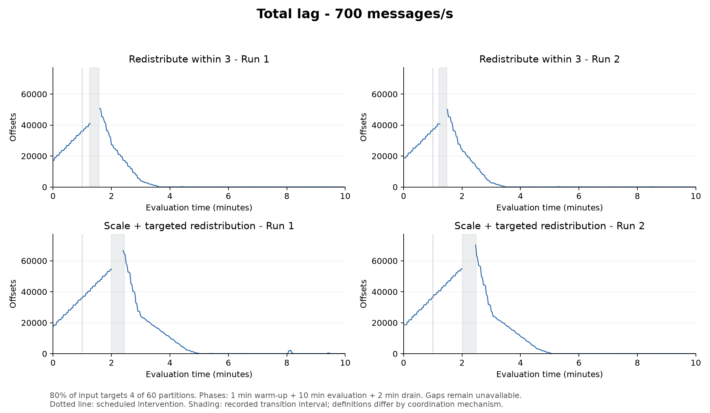

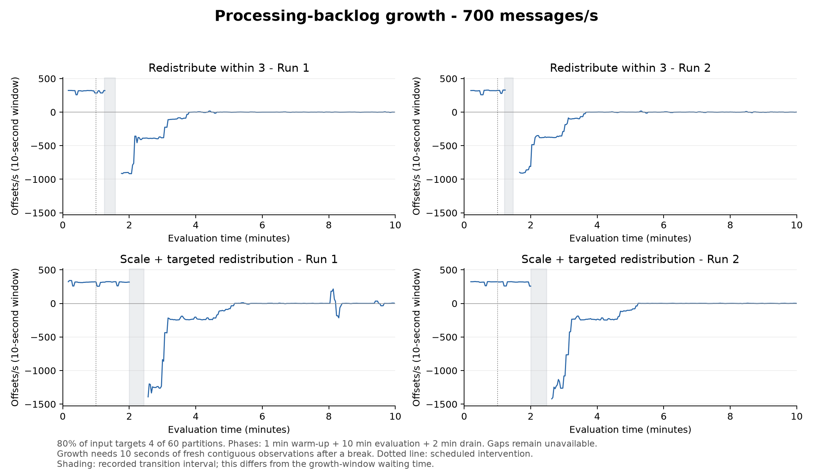

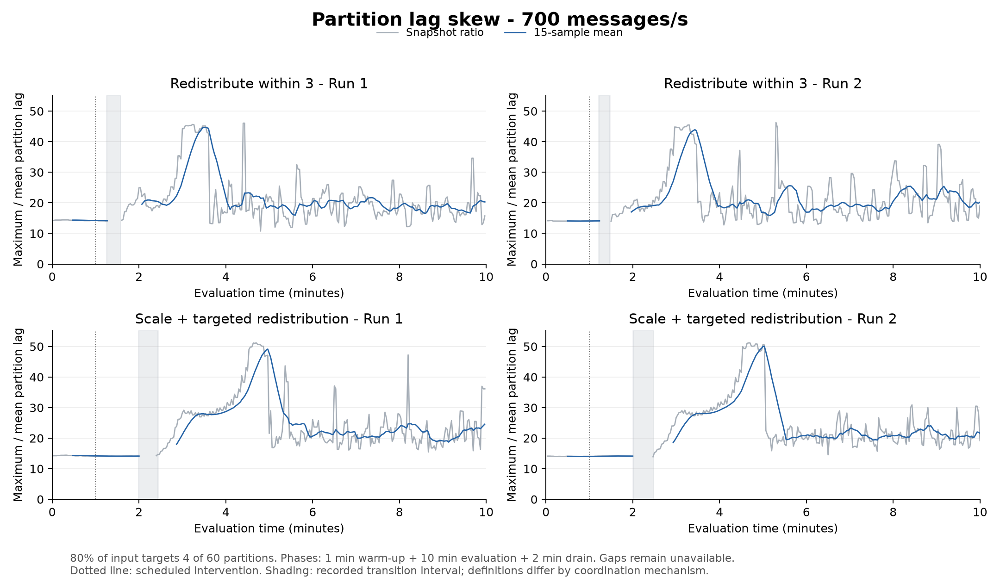

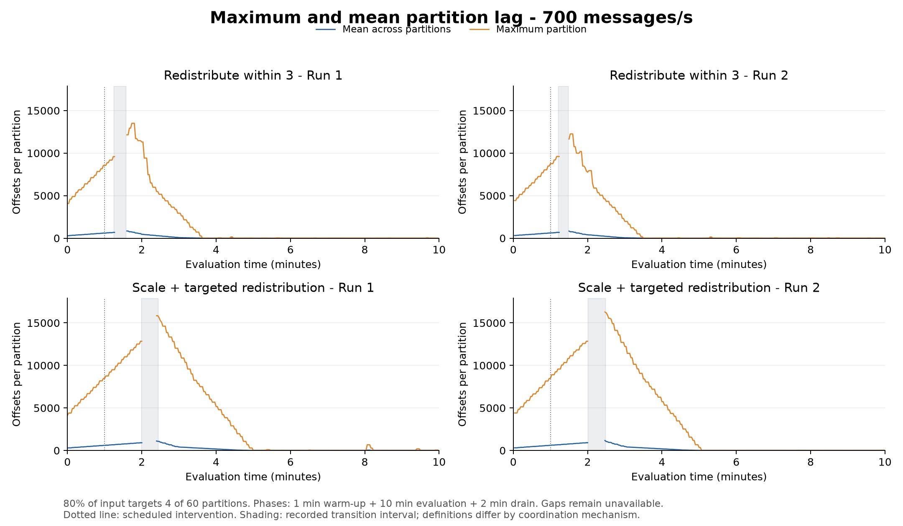

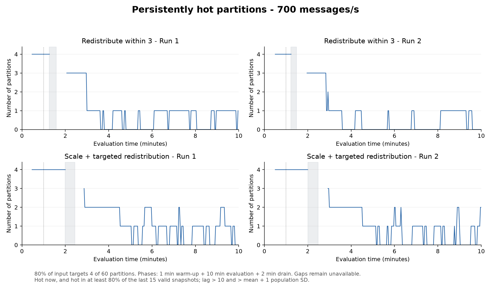

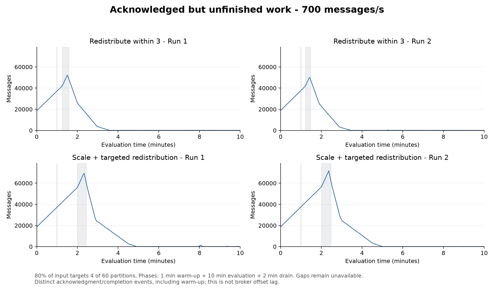

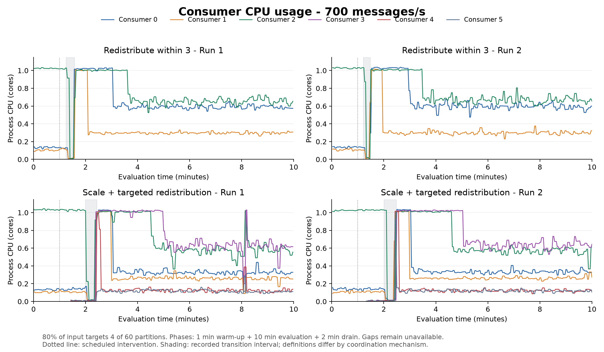

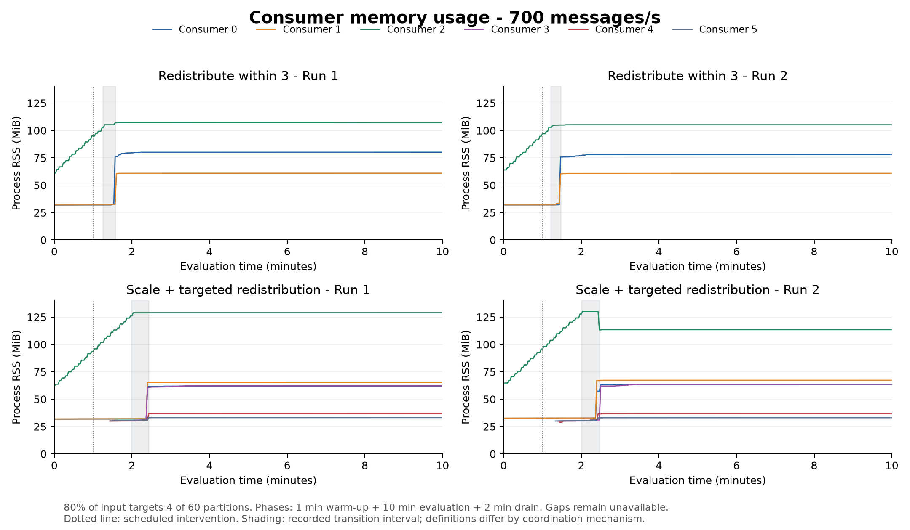

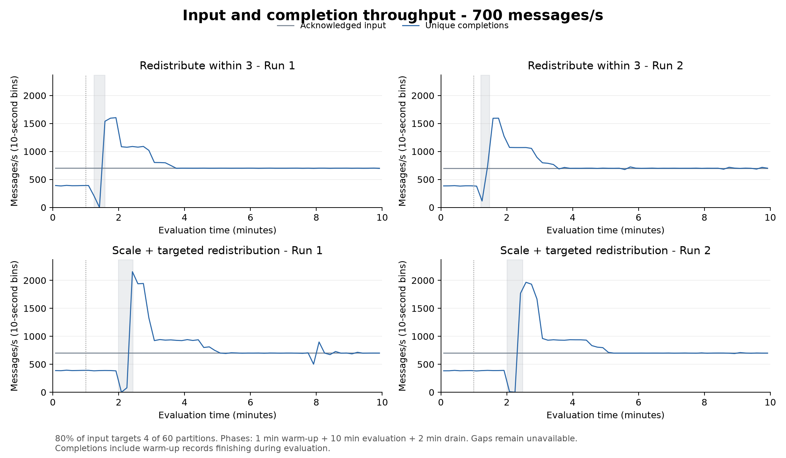

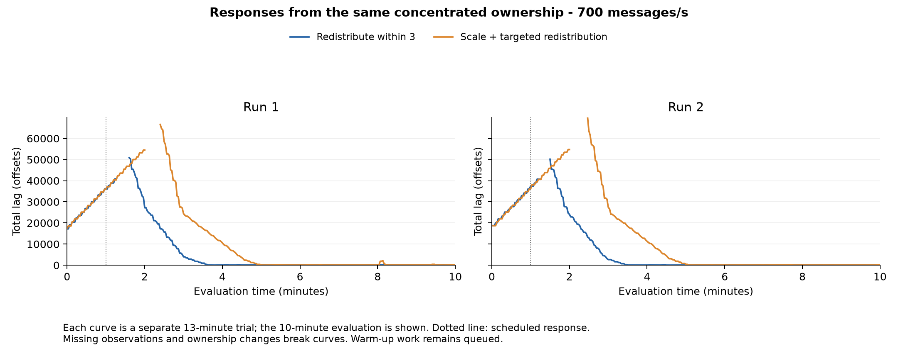

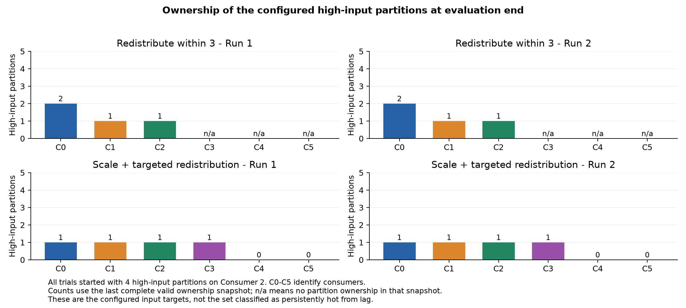

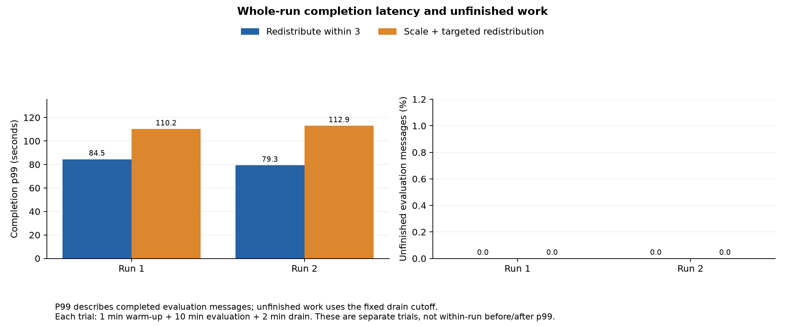

