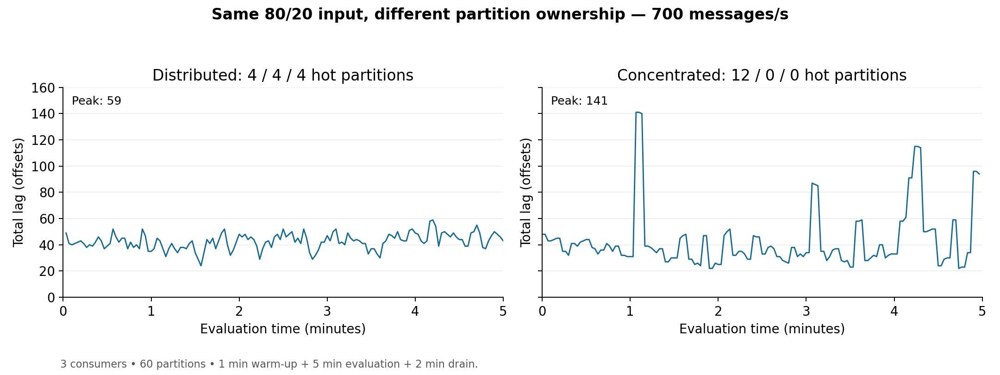

# Hot-partition ownership calibration — 27 September 2026

The original two-trial record is preserved below. See the [combined four-layout report](../hot-ownership-consumers-20260927/README.md) for the completed Consumer 2 and Consumer 1 follow-ups and all comparison plots.

Two trials at **700 aggregate messages/s**, with three consumers and 60 partitions, are complete. Each lasted **8 minutes: 1 minute warm-up, 5 minutes evaluation, 2 minutes drain**. The same twelve hot partitions received 80% of input in both trials; only their initial consumer ownership changed. Every consumer owned 20 total partitions.

| Layout | Hot partitions on consumers 0 / 1 / 2 | Completion p99 | Unfinished at cutoff | Peak total lag |
|---|---|---:|---:|---:|
| Distributed | 4 / 4 / 4 | 0.193 s | 0 / 210,000 | 59 offsets |
| Concentrated | 12 / 0 / 0 | 0.249 s | 0 / 210,000 | 141 offsets |

Both traces show small, fluctuating lag over the observed evaluation interval. Concentrating traffic on Consumer 0 raised short-lived lag peaks and completion p99. Its mean process CPU increased from **0.431 to 1.004 cores**, while Consumers 1 and 2 received much less work. This particular concentration did **not** produce sustained overload during the five-minute evaluation.

This is a useful calibration result: skewed traffic alone does not establish that redistribution is necessary. The selected consumer's effective processing capacity and the observed backlog trend matter. These two trials neither establish long-term stability nor measure the benefit or disruption of a live redistribution action. They used fixed initial assignments, with no scaling or mid-run handoff, and only one trial per layout in a fixed order.

Exact starting ownership was verified before traffic was released. Collected resource snapshots show the same consumer pod UIDs and machines across both trials; no new node-pinning constraint was introduced. Every valid lag snapshot matched the intended ownership and process identities. There were no detected duplicate completion attempts, conflicting identities or within-epoch ordering violations in the recorded checks. These checks are not a general exactly-once guarantee for external application effects. Lag and process-resource coverage was **99.33%** in both evaluation intervals, with missing observations retained as gaps.

[Detailed metric tables and diagnostics](RESULTS.md) · [Exact values, configuration and evidence hashes](comparison.json) · [Execution and restoration checks](execution-record.json) · [Reviewed configurations and analysis commands](../../experiments/hot-ownership-20260927/README.md)

[CPU, memory, throughput and backlog-growth plots](ownership-diagnostics.png) · [Lag PDF](ownership-lag.pdf) · [Diagnostics PDF](ownership-diagnostics.pdf)

Execution used commit `1e10fa3fff315a750a47bf108cdc6feaa7c193a7`. Raw message records and complete Prometheus exports are retained separately in `results/run-20260927-020225` and `results/run-20260927-021335`; those large directories are excluded from Git. The repository summary and hashes do not replace a backup of the raw evidence. Producer and consumer applications were stopped, and the original shared configuration was restored and verified after the block.
