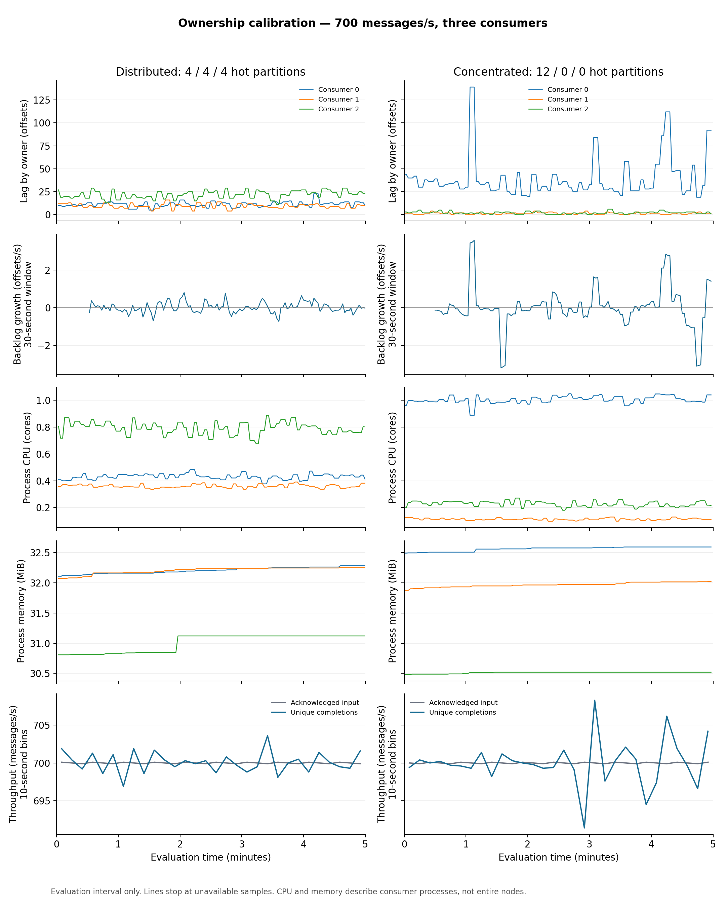

# Hot-partition ownership: initial calibration

Both trials used 700 aggregate messages/s, three consumers, and the same 80/20 workload across 60 partitions. Each lasted eight minutes: one minute warm-up, five minutes evaluation and two minutes drain. Every consumer owned 20 partitions. Exact starting ownership was verified before releasing traffic.

| Starting layout | Mean lag (offsets) | Peak lag (offsets) | Completion p99 (s) | Unfinished at cutoff | Useful throughput (msg/s) |
|---|---:|---:|---:|---:|---:|
| Distributed | 42.6 | 59 | 0.193 | 0 / 210,000 (0.000%) | 700.08 |
| Concentrated | 42.9 | 141 | 0.249 | 0 / 210,000 (0.000%) | 699.99 |

| Layout | Consumer | Observed input (msg/s) | Mean process CPU (cores) | Mean process RSS (MiB) |
|---|---|---:|---:|---:|
| Distributed | 0 | 233.81 | 0.431 | 32.2 |
| Distributed | 1 | 233.23 | 0.360 | 32.2 |
| Distributed | 2 | 232.96 | 0.791 | 31.0 |
| Concentrated | 0 | 584.06 | 1.004 | 32.6 |
| Concentrated | 1 | 57.86 | 0.114 | 32.0 |
| Concentrated | 2 | 58.08 | 0.228 | 30.5 |

Mean lag is time-weighted over valid observations. Lag coverage: distributed: 99.33%, concentrated: 99.33%.

Whole-evaluation processing-backlog growth: distributed: -0.020 offsets/s, concentrated: +0.154 offsets/s. These endpoint-based summaries are sensitive to short fluctuations; inspect the retained time series.

Useful throughput counts distinct messages completed during evaluation, including any warm-up messages finishing in that interval. CPU and RSS means cover observed fresh intervals; the JSON records resource coverage separately.

The distributed layout assigned four hot partitions to each consumer. The concentrated layout assigned all twelve to Consumer 0. Its expected input, including cold partitions, was 583.33 msg/s, versus 58.33 msg/s on each other consumer.

These are initial-layout calibrations, once each. They do not measure the benefit or interruption cost of a live redistribution action, nor establish long-term stability. Consumer machine placement was recorded; machines were not newly pinned. Warm-up work remained in the pipeline. Latency excludes unfinished messages and ends before commit acknowledgment.

The JSON summary retains exact outcomes, deadline results, actual traffic by initial owner, backlog growth windows, process CPU/RSS, resource requests, configuration, execution revision and evidence hashes. Raw events and Prometheus exports remain in the run evidence folders.

