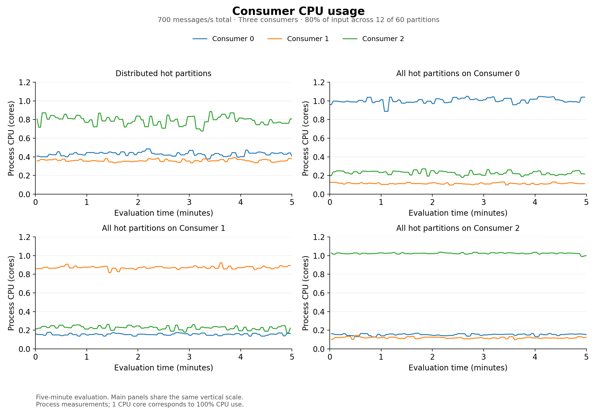
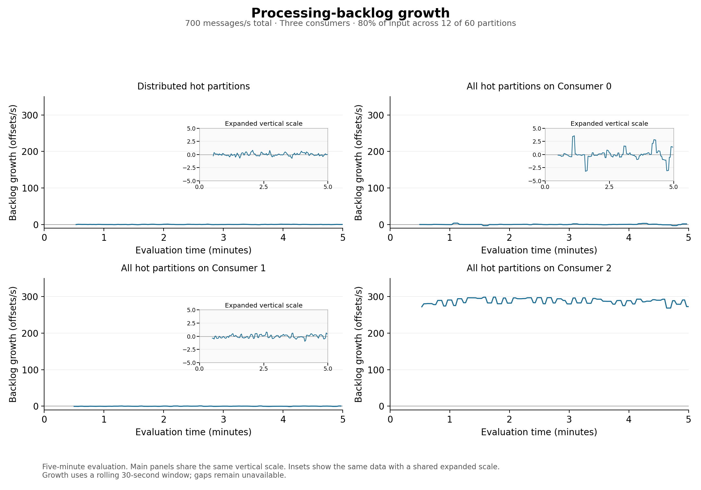

# Hot-partition ownership: four completed calibrations

At **700 aggregate messages/s**, the distributed layout and concentration on Consumers 0 and 1 kept lag small during the observed evaluation. Concentration on Consumer 2 produced sustained backlog growth and substantial unfinished work. These results show why workload distribution must be considered together with the selected consumer's observed processing capacity.

Every trial used three consumers, 60 partitions, and the same 80/20 input: partition IDs 0–11 received 80% of traffic. Each consumer owned 20 total partitions. The schedule was **8 minutes: 1 minute warm-up, 5 minutes evaluation, 2 minutes drain**. There was one trial per layout, executed in the order below.

| Starting layout | Peak lag (offsets) | Completion p99 (s) | Unfinished after drain | Useful throughput during evaluation (msg/s) |
|---|---:|---:|---:|---:|
| Four hot partitions per consumer | 59 | 0.193 | 0 / 210,000 | 700.08 |
| All twelve hot partitions on Consumer 0 | 141 | 0.249 | 0 / 210,000 | 699.99 |
| All twelve hot partitions on Consumer 2 | 102,475 | 233.857 | 67,801 / 210,000 (32.286%) | 413.15 |
| All twelve hot partitions on Consumer 1 | 58 | 0.248 | 0 / 210,000 | 699.99 |

Completion p99 includes only evaluation messages completed by the observation cutoff and ends before commit acknowledgment. The unfinished count describes the remaining evaluation work. Useful throughput counts distinct completions occurring during evaluation, including warm-up messages finishing then; that is why it can differ slightly from the evaluation-cohort arrival rate. Warm-up work was retained in the system, so the Consumer 2 evaluation began with accumulated backlog.

Consumer 2's processing backlog grew by **288.32 offsets/s** over covered evaluation intervals. Its mean process CPU use was **1.024 cores**, while Consumers 0 and 1 used **0.152 and 0.118 cores** in that layout. Consumer 2's mean process RSS was **145.4 MiB**, compared with approximately **31.9 MiB** on the other two consumers. With concentration on Consumer 1, its mean CPU use was **0.871 cores** and mean RSS **32.4 MiB**. The process-memory rise in the Consumer 2 trace is an observation; this calibration does not identify its allocation sources.

The mean partition lag-skew ratios were **9.24, 9.25, 4.93 and 10.00**, respectively. A lower ratio did not imply a healthier pipeline: the Consumer 2 case accumulated large queues across multiple hot partitions, while the other layouts had much smaller absolute queues. Skew must therefore be interpreted with backlog magnitude, growth and processing capacity. These means average valid snapshot ratios; they are not ratios calculated from aggregated lags.

## Plots and evidence

The primary comparison uses **one 2×2 figure per metric**. Every figure displays distributed ownership at top left, Consumer 0 at top right, Consumer 1 at bottom left, and Consumer 2 at bottom right. Consumer colors remain blue, orange and green throughout. This display order differs from the actual execution order retained in the table and evidence above.

Main panels within each metric grid share a vertical scale. Lag-by-consumer and growth figures include labeled insets showing the small fluctuations on a shared expanded scale. The separate total-lag overview keeps its explicitly labeled larger vertical scale for Consumer 2. All plots show the five-minute evaluation interval; observations and metric definitions are unchanged.

**[Download all seven comparison figures in one PDF](ownership-metrics.pdf)**

| Metric | Figure | PDF |
|---|---|---|
| Consumer CPU use | [Four-run comparison](ownership-cpu.png) | [PDF](ownership-cpu.pdf) |
| Consumer memory (RSS) | [Four-run comparison](ownership-memory.png) | [PDF](ownership-memory.pdf) |
| Input and completion throughput | [Four-run comparison](ownership-throughput.png) | [PDF](ownership-throughput.pdf) |
| Processing-backlog growth | [Four-run comparison](ownership-growth.png) | [PDF](ownership-growth.pdf) |
| Lag by consumer | [Four-run comparison](ownership-owners.png) | [PDF](ownership-owners.pdf) |
| Total lag | [Four-run comparison](ownership-lag.png) | [PDF](ownership-lag.pdf) |
| Partition lag-skew ratio | [Four-run comparison](ownership-skew.png) | [PDF](ownership-skew.pdf) |

- [Detailed metric tables and all figures](RESULTS.md)
- [Consumer 2 lag, full size](concentrated-c2-lag.png)
- [Exact outcomes, configurations, resource measurements and evidence hashes](comparison.json)
- [Execution, placement and restoration checks](execution-record.json)
- [Reviewed configurations and reproduction commands](../../experiments/hot-ownership-20260927/README.md)

The earlier paired figures remain available for existing references: [distributed and Consumer 0](ownership-diagnostics.png), and [Consumer 2 and Consumer 1](ownership-diagnostics-2.png).

## Interpretation and validation

The original distributed and Consumer 0 trials motivated the later concentration tests. In the distributed trial, Consumer 2 used 0.791 CPU cores at approximately the same input at which Consumers 0 and 1 used 0.431 and 0.360 cores. This suggested less processing headroom and motivated the Consumer 2 test. The later choices were exploratory; this was not a prespecified confirmatory comparison.

Exact starting ownership was verified before traffic was released. All valid lag snapshots matched the intended owners and process identities. Recorded resource snapshots showed the same original consumer pod UIDs and machines throughout all four trials; no new node-pinning constraint was added. The measurement audits reported no issues. Recorded checks found no duplicate completion attempts, conflicting identities or within-epoch ordering violations. They do not establish exactly-once behavior for external application effects. Evaluation lag and process-resource coverage was **99.33%**; unavailable observations were retained as gaps.

The first two trials used execution commit `1e10fa3fff315a750a47bf108cdc6feaa7c193a7`; the Consumer 2 and Consumer 1 trials used `6e17ce3f123ffb642558583fe2c2a72b5322c531`. The follow-up commit added reviewed layout selection and configurations; the application source hashes passed the preflight checks. Raw records are retained separately under the four run directories identified in `comparison.json`; these large files are excluded from Git. Versioned summaries are not backups of raw evidence. Both campaigns restored their saved shared configuration. After the final campaign, all six application processes were confirmed stopped.

These trials used fixed initial ownership, with no scaling or live redistribution. One trial per layout, a fixed order, and shared-machine variability limit causal and long-term stability claims. The next proposed step is to validate live handoff correctness, then compare leaving hot partitions on Consumer 2 with redistributing them across the same three consumers under common workload and timing settings. That intervention comparison has not yet been run.
