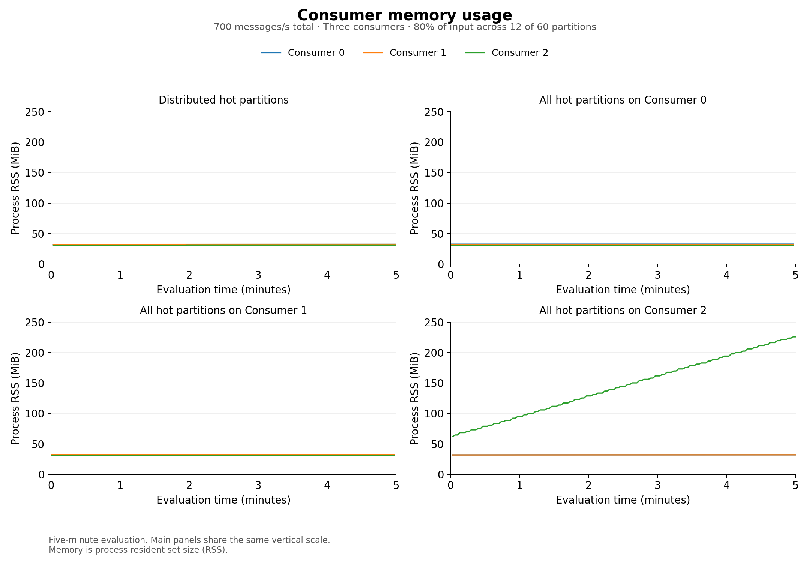
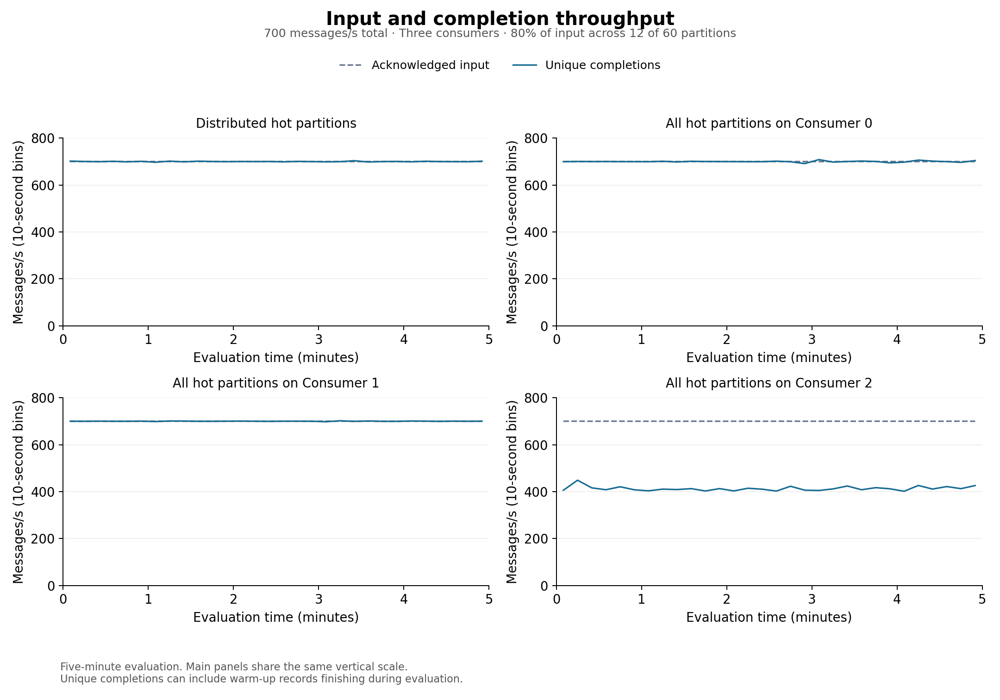
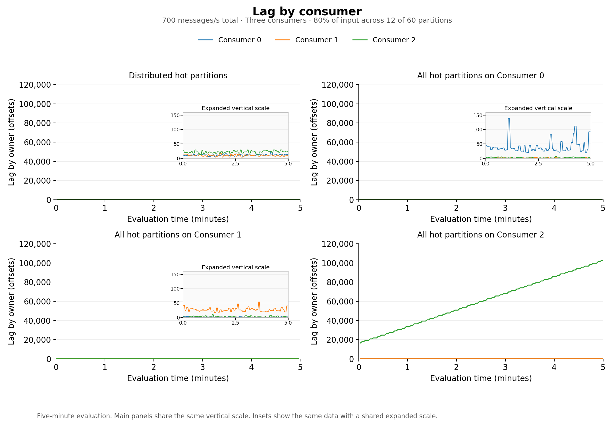
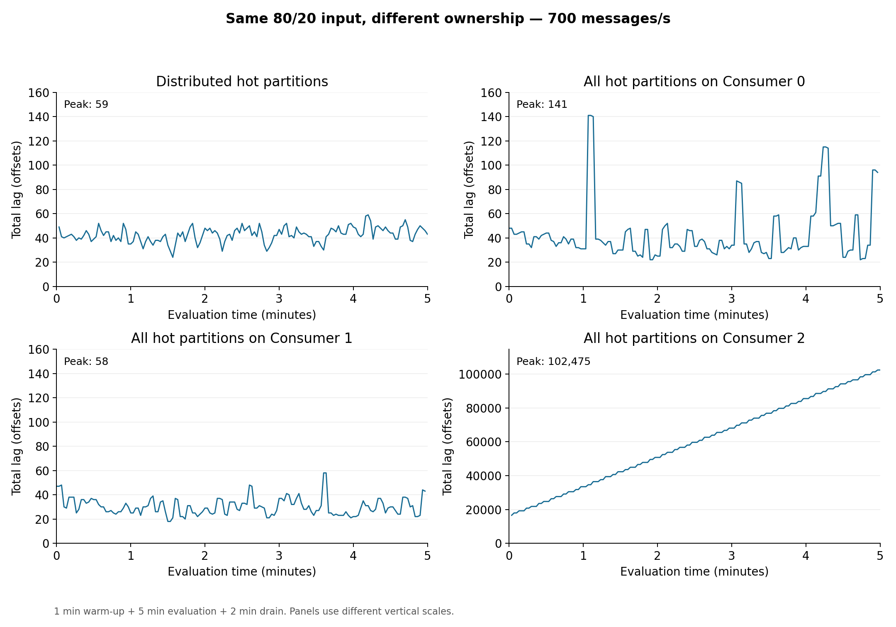
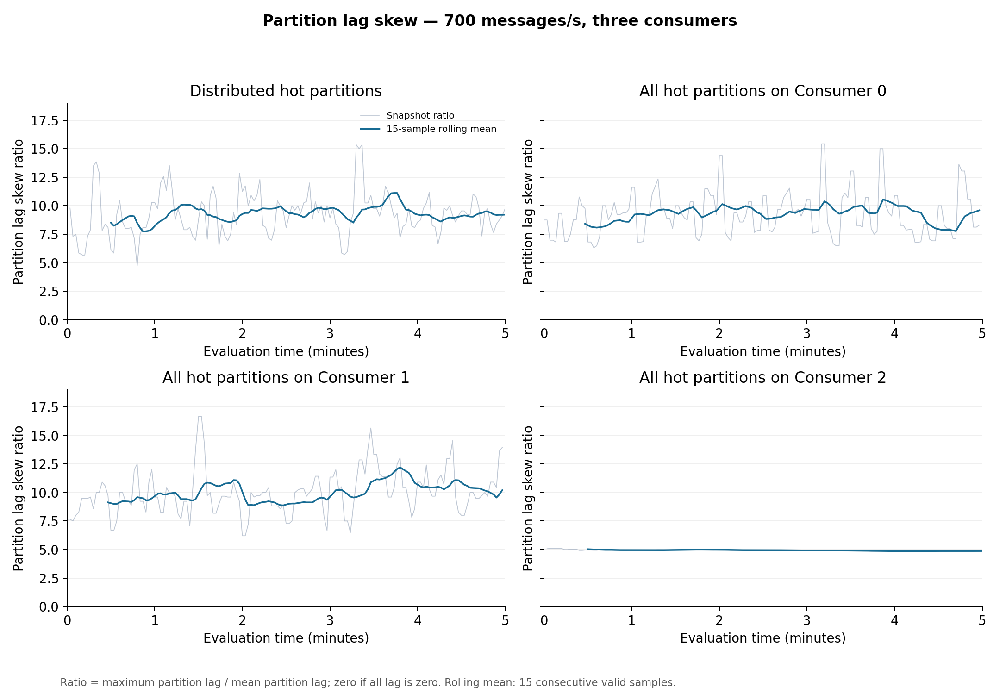

# Hot-partition ownership calibration

These 4 trials used 700 aggregate messages/s, three consumers and the same 80/20 workload across 60 partitions. Each lasted eight minutes: one warm-up, five evaluation and two drain. Every consumer owned 20 partitions. Exact starting ownership was verified before traffic.

| Layout | Mean lag (offsets) | Peak lag (offsets) | Completion p99 (s) | Unfinished at cutoff | Useful throughput (msg/s) |
|---|---:|---:|---:|---:|---:|
| Distributed hot partitions | 42.6 | 59 | 0.193 | 0 / 210,000 (0.000%) | 700.08 |
| All hot partitions on Consumer 0 | 42.9 | 141 | 0.249 | 0 / 210,000 (0.000%) | 699.99 |
| All hot partitions on Consumer 2 | 59823.6 | 102,475 | 233.857 | 67,801 / 210,000 (32.286%) | 413.15 |
| All hot partitions on Consumer 1 | 30.2 | 58 | 0.248 | 0 / 210,000 (0.000%) | 699.99 |

| Layout | Mean snapshot lag-skew ratio | Whole-evaluation backlog growth (offsets/s) | Lag coverage |
|---|---:|---:|---:|
| Distributed hot partitions | 9.241 | -0.020 | 99.33% |
| All hot partitions on Consumer 0 | 9.252 | +0.154 | 99.33% |
| All hot partitions on Consumer 2 | 4.927 | +288.319 | 99.33% |
| All hot partitions on Consumer 1 | 10.004 | -0.013 | 99.33% |

| Layout | Consumer | Observed input (msg/s) | Mean process CPU (cores) | Mean process RSS (MiB) |
|---|---|---:|---:|---:|
| Distributed hot partitions | 0 | 233.81 | 0.431 | 32.2 |
| Distributed hot partitions | 1 | 233.23 | 0.360 | 32.2 |
| Distributed hot partitions | 2 | 232.96 | 0.791 | 31.0 |
| All hot partitions on Consumer 0 | 0 | 584.06 | 1.004 | 32.6 |
| All hot partitions on Consumer 0 | 1 | 57.86 | 0.114 | 32.0 |
| All hot partitions on Consumer 0 | 2 | 58.08 | 0.228 | 30.5 |
| All hot partitions on Consumer 2 | 0 | 58.29 | 0.152 | 31.9 |
| All hot partitions on Consumer 2 | 1 | 57.82 | 0.118 | 31.9 |
| All hot partitions on Consumer 2 | 2 | 583.89 | 1.024 | 145.4 |
| All hot partitions on Consumer 1 | 0 | 58.46 | 0.155 | 31.9 |
| All hot partitions on Consumer 1 | 1 | 583.77 | 0.871 | 32.4 |
| All hot partitions on Consumer 1 | 2 | 57.78 | 0.225 | 30.6 |

Mean lag is time-weighted over valid observations. Mean snapshot skew is the arithmetic mean of valid instantaneous maximum/mean lag ratios. Skew describes relative partition imbalance and must be interpreted with backlog magnitude and growth. A large ratio can occur with little absolute lag. Backlog-growth summaries use covered intervals without bridging gaps. The figures also show the rolling 30-second growth trace.

Useful throughput counts distinct completions during evaluation, including any warm-up records finishing then. CPU and RSS means cover observed fresh intervals; resource coverage is retained separately in JSON. Cohort latency excludes unfinished records, retains the effect of queued warm-up work, and ends before commit acknowledgment.

These are initial-layout calibrations, once each, with no live redistribution or scaling. No additional node-pinning constraint was introduced. Later concentration targets were selected after the earlier observations; these are exploratory calibration outcomes. Retain unfavorable valid results and do not infer a general mitigation benefit or permanent stability.

The JSON retains configuration, exact outcomes, deadlines, skew, growth windows, resource data, per-run execution revisions and evidence hashes. Raw message evidence and full monitoring exports are stored separately; this summary is not a raw-data backup.

Figures use the same display order: distributed, Consumer 0, Consumer 1, Consumer 2. Tables and evidence retain actual execution order. Each metric grid uses shared main-panel scales; labeled insets expand small lag and growth fluctuations. The total-lag overview retains its explicitly labeled separate scales.

[All comparison figures in one PDF](ownership-metrics.pdf)

