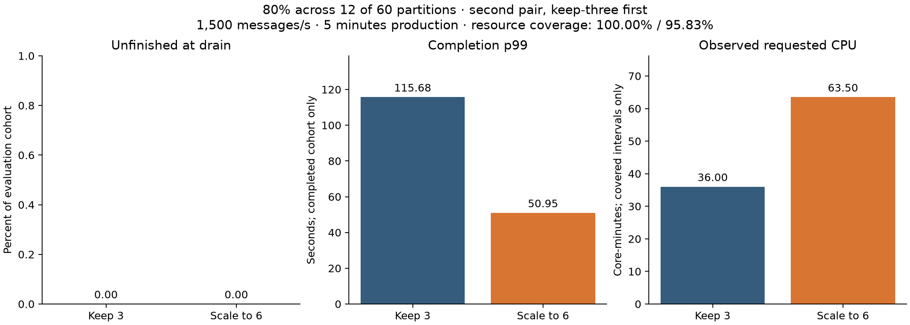

# 80% across 12 of 60 partitions: second matched-start comparison

Four empty preparations and both performance trials completed. Keep-three ran first, followed by scale-to-six. Both used seed 71, the same frozen starting ownership and original pod identities within this block. Original settings were restored and application shutdown was verified.

Each trial used three producers at 1,500 messages/s total, 60 partitions, 100-byte payload setting, 2,000 SHA-256 iterations and no artificial sleep. Production lasted 300 seconds including 60 seconds warm-up, followed by 120 seconds drain. The decision was scheduled at production +120 seconds.

| Treatment | Evaluation messages | Unfinished | Completion p99 (s) | Observed requested CPU (core-min) | Lag coverage | Resource coverage |
|---|---:|---:|---:|---:|---:|---:|
| Keep 3 | 360,000 | 0 (0.00%) | 115.682 | 36.00 | 99.17% | 100.00% |
| Scale to 6 | 360,000 | 0 (0.00%) | 50.954 | 63.50 | 90.83% | 95.83% |

Completion is after application work and before commit acknowledgment. P99 includes only distinct acknowledged evaluation messages completed by drain. Read unfinished outcomes alongside latency. Requested CPU is integrated only over observed intervals within the common evaluation-through-drain horizon; it is not an actual monetary bill. With incomplete resource coverage, report the observed amount and coverage rather than a complete-run resource percentage difference.

Compared with the preceding block: same complete initial assignment = **True**; same original pod identities/resources/nodes = **True**. New consumer placement and shared-machine contention remain uncontrolled. These two blocks are repetitions, not proof of a general causal effect.

Both lag coverages meet the 90% screen.

- none: measured selected-partition traffic 80.019%; resource coverage 100.00%; duplicate completion attempts 0; recovery status not_observed_by_evaluation_end.
- scale: measured selected-partition traffic 80.019%; resource coverage 95.83%; duplicate completion attempts 0; recovery status not_observed_by_evaluation_end.
- consumer-sts-3: request to first completion 185.22418189048767 seconds; node k8s-chase-ci-07.calit2.optiputer.net.
- consumer-sts-4: request to first completion 17.85296940803528 seconds; node k8s-u200-00.calit2.optiputer.net.
- consumer-sts-5: request to first completion 17.91781234741211 seconds; node k8s-chase-ci-04.calit2.optiputer.net.

All-finished by drain is distinct from recovery during continued input. The 99 ms deadline remains provisional, and cross-node clock uncertainty is not independently measured. No reassignment, key splitting or adaptive selector was tested.

Executed revision: `602649709a3a0485b72bac3317f374958e2ca60e`. All 126 collected evidence files matched their PVC hashes. The verified local raw-evidence archive is described in [backup manifest](evidence-backup-manifest.json); it is not an off-machine backup.

[Exact summary](summary.json) · [Paired calculations](comparison/comparison-summary.json) · [Keep-three plots](plots/none/overview.png) · [Scaling plots](plots/scale/overview.png) · [Keep-three commit audit](transitions/none/transition-audit.json) · [Scaling commit audit](transitions/scale/transition-audit.json)

The sixth consumer first completed work about 254 seconds after evaluation start, after the 240-second production evaluation window. Thus this run measures a request to scale to six with delayed capacity, not six consumers processing throughout the post-decision production period. Six commit-error events were followed by covering successes; final commits covered acknowledged ends for all 60 partitions.
