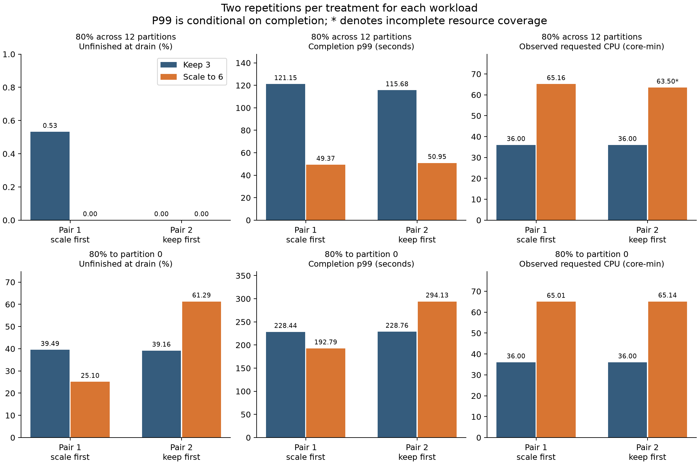

# Repeated skew comparisons

Both workloads now have two matched-start pairs: two runs keeping three consumers and two scaling to six. The second pair reverses treatment order while keeping the same seed and workload. The initial attempt was aborted during empty preparation after a Kubernetes API failure, retained separately, and contributed no performance results.

| Workload | Pair | Keep-three unfinished | Scaling unfinished | Keep-three p99 (s) | Scaling p99 (s) |
|---|---:|---:|---:|---:|---:|
| 80% across 12 partitions | 1 | 0.53% | 0.00% | 121.15 | 49.37 |
| 80% across 12 partitions | 2 | 0.00% | 0.00% | 115.68 | 50.95 |
| 80% to partition 0 | 1 | 39.49% | 25.10% | 228.44 | 192.79 |
| 80% to partition 0 | 2 | 39.16% | 61.29% | 228.76 | 294.13 |

Each trial used 1,500 messages/s total, 2,000 SHA-256 iterations per message, five minutes production including one minute warm-up, and two minutes drain. P99 includes only completed evaluation messages and completion precedes commit acknowledgment. Finishing by drain does not prove recovery under continued input. Resource bars marked * cover observed intervals only; see each report for coverage. Shared-machine contention and new-consumer placement remain uncontrolled; two pairs provide preliminary replication, not a precise population estimate.

[80/20 second pair](8020/README.md) · [Single-partition second pair](single-partition/README.md) · [Aborted empty preparation](aborted-8020-preparation/README.md)

## Interpretation

**80/20 across 12 partitions:** scaling lowered conditional completion p99 in both pairs. Scaling finished all evaluation messages in both runs; one keep-three run also finished everything, so a benefit in unfinished fraction was not repeated in both pairs. One added consumer arrived during drain in pair 2, and its resource coverage was incomplete; these limits stay attached to the result.

**80% to one partition:** the result was mixed. Scaling improved pair 1 but worsened pair 2. In pair 2 the hot partition moved onto an owner with a longer recorded application-task duration. The [ownership review](single-partition/ownership-review.md) documents this without claiming a hardware-only cause. The initial controls passed; post-scaling placement and effective capacity remained variable.

These are useful preliminary scheduled-action results, not evidence that a new automatic selector beats existing policies. No research baseline, fixed-count reassignment, original-hot-key splitting or combined selector was evaluated. All requested repetitions are complete; no further run is queued.
