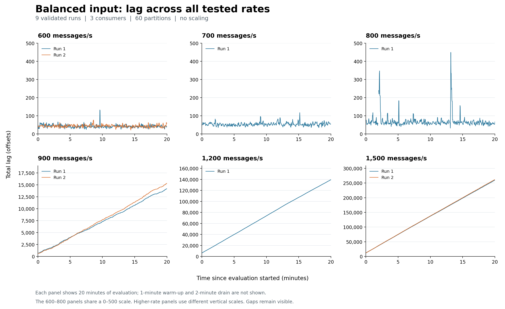

# Balanced-rate calibration: twelve trials

Two trials at each rate used three consumers, sixty partitions and no mitigation. Each trial lasted 23 minutes: one warm-up, twenty evaluation and two drain. Rates are totals across three producers. Growth below covers the final ten evaluation minutes and does not bridge missing observations.

| Aggregate rate (msg/s) | p99 Run 1 / Run 2 (s) | Unfinished Run 1 / Run 2 (%) | Late backlog growth Run 1 / Run 2 (offsets/s) |
|---:|---:|---:|---:|
| 600 | 0.237 / 0.197 | 0.00 / 0.00 | -0.01 / 0.02 |
| 700 | 0.248 / 0.395 | 0.00 / 0.00 | 0.00 / -0.02 |
| 800 | 0.585 / 0.332 | 0.00 / 0.00 | 0.01 / -0.02 |
| 900 | 47.400 / 51.411 | 0.00 / 0.00 | 11.48 / 12.69 |
| 1,200 | 346.338 / 333.600 | 7.27 / 6.50 | 109.86 / 102.93 |
| 1,500 | 553.561 / 549.487 | 12.50 / 12.62 | 205.54 / 205.06 |

Backlog remained bounded at 600–800 messages/s during these observations. At 900 messages/s it grew during production even though drain allowed all evaluation messages to finish. The higher rates left unfinished work at the cutoff. I selected 700 messages/s as the balanced reference for subsequent skew comparisons, with some margin below the observed boundary.

[Figure PDF](all-balanced-rates-lag.pdf) · [Numerical results and evidence hashes](comparison-data.json) · [Figure data](all-balanced-rates-lag.json) · [Protocol](../../experiments/stability-fixed3-20260921/README.md)

These finite trials do not establish a permanent stability guarantee or a capacity limit for other machine placements. Completion p99 excludes unfinished records, whose percentage is reported beside it.
