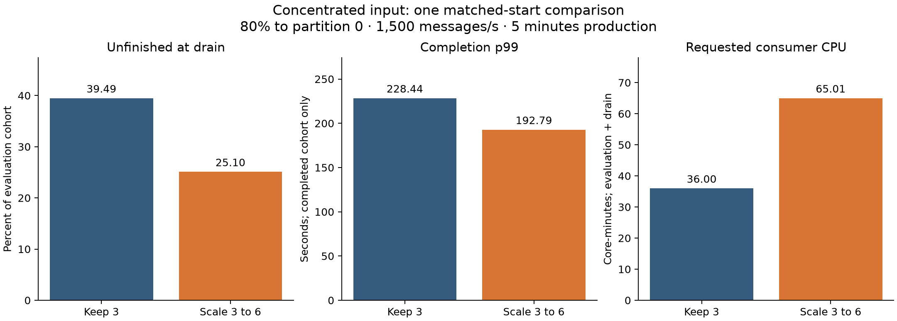
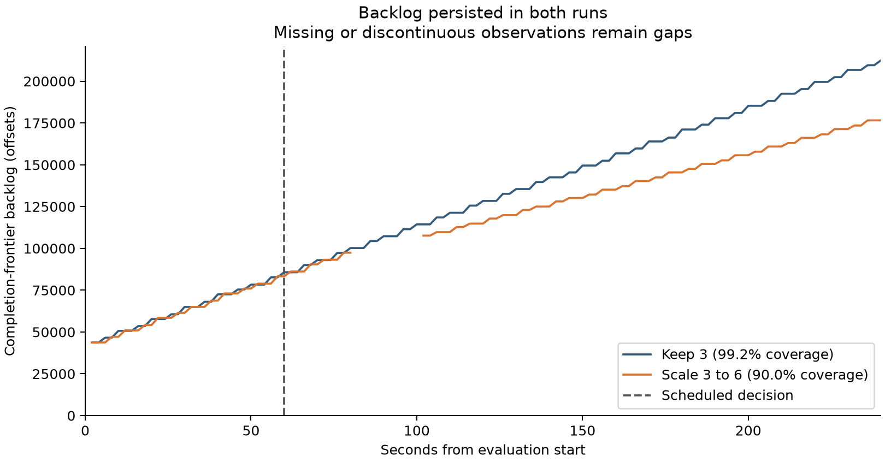

# Controlled concentrated-input repeat — 12 September 2026

Four empty preparations and both performance trials completed. Original shared configuration, HPA identity/settings and replica counts were restored and verified. A separate check found all nine experiment applications stopped. Consumer source was synchronized for this block; restoration of configuration does not revert that source deployment.

This is one new comparison, separate from the earlier 16 trials. Both treatments used the same static-membership setup and workload seed 71. Three producers targeted 1,500 messages/s total, 80% to partition 0, 60 partitions, 100-byte payload setting, 2,000 SHA-256 iterations and no artificial sleep. Production lasted 300 seconds including 60 seconds warm-up, followed by 120 seconds drain. The order was scale then keep-three, as approved before execution.

| Treatment | Evaluation messages | Unfinished | Completion p99 (s) | Requested CPU (core-min) | Lag coverage |
|---|---:|---:|---:|---:|---:|
| Keep 3 | 360,000 | 142,181 (39.49%) | 228.44 | 36.00 | 99.17% |
| Scale 3 to 6 | 360,000 | 90,372 (25.10%) | 192.79 | 65.01 | 90.00% |

The evaluation-to-drain resource horizon is 360 seconds, with 100% resource coverage in both runs. Requested CPU measures container declarations, not actual CPU consumption or monetary cost. P99 covers only completed distinct acknowledged evaluation messages, with completion before commit acknowledgment. The provisional 99 ms threshold is retained in raw summaries but is not used for an SLA success claim.

The observed unfinished fraction and conditional p99 were lower in the scaling trial, with greater requested CPU. Backlog continued growing in valid observations after scaling; neither run confirmed the predeclared recovery condition (1,500 offsets or less for 20 seconds before production ended). The drain is a separate period. Lag coverage meets the 90% aggregate screen, but missing transition intervals remain missing.

## What was controlled and what was not

The first preparation captured the actual complete 60-partition assignment, then froze it. The next three empty preparations checked restart with three consumers, six consumers, and return to three. All four passed zero-message audits. Both real trials independently passed the same ownership and original-pod identity checks before production and before the scheduled decision. No new node-placement constraint was added.

Partition 0 started on Consumer 0 / patternlab in both trials. Consumer 1 stayed on k8s-gpu-01 and Consumer 2 on unseenu in the frozen starting group. During scaling, recorded assignment events moved partition 0 from Consumer 0 to Consumer 5 and then Consumer 4 (k8s-usra-01). The added-consumer placement was not fixed in advance. Event timestamps on different machines do not establish precise millisecond handover durations.

The scaling decision was recorded about 8.86 seconds after the scheduled point; the keep decision about 7.65 seconds afterward. These measured delays are retained; the action did not occur exactly at production +120 seconds. The backlog plot marks the scheduled point.

This addresses the earlier starting-owner/machine mismatch for this pair. It does not remove changing shared-machine contention or isolate replica count from the resulting reassignment to another machine. There is only one pair in one order, so it is descriptive preliminary evidence, not a general causal estimate or proof that another mitigation would work better. Static membership also distinguishes this block from the earlier dynamic-membership campaign.

## Run records

- [run-20260912-232219](../run-20260912-232219/validation-report.md): capture_three, preparation_verified.
- [run-20260912-232440](../run-20260912-232440/validation-report.md): restart_three, preparation_verified.
- [run-20260912-232915](../run-20260912-232915/validation-report.md): prepare_six, preparation_verified.
- [run-20260912-233151](../run-20260912-233151/validation-report.md): return_to_three, preparation_verified.
- [run-20260912-233413](../run-20260912-233413/validation-report.md): scale_trial, complete.
- [run-20260912-234504](../run-20260912-234504/validation-report.md): keep_trial, complete.

## Partition outcomes

- none: partition 0 had 134,217 unfinished evaluation messages; the other 59 partitions had 7,964. Partition-0 evaluation admissions averaged 1199.68/s and distinct completions during evaluation 545.36/s.
- scale: partition 0 had 88,825 unfinished evaluation messages; the other 59 partitions had 1,547. Partition-0 evaluation admissions averaged 1199.67/s and distinct completions during evaluation 649.11/s.

Completion rates above include completions of earlier admissions; unfinished counts follow the evaluation-admission cohort. They are different populations.

## Evidence and provenance

Executed commit: `411bae61af51bcb3d0cbf1adfb33b5d559288ddf`. All 126 collected producer/consumer evidence files matched their original PVC hashes. Cumulative preparation: 946.91 seconds, within the 1,200-second bound. No retry or reference replacement occurred.

[Machine-readable summary](summary.json), [paired calculations](comparison/comparison-summary.json), [scaling plots](plots/scale/overview.png), [keep-three plots](plots/none/overview.png). Full raw data stays in `results/RUN_ID/` and outside Git; these summaries are not a raw-data backup.

A separate local lossless archive of all six result directories was verified file by file (182 files, 59,615,855 compressed bytes). The [backup manifest](evidence-backup-manifest.json) records hashes and location. It is on this Mac, not an off-machine backup.
